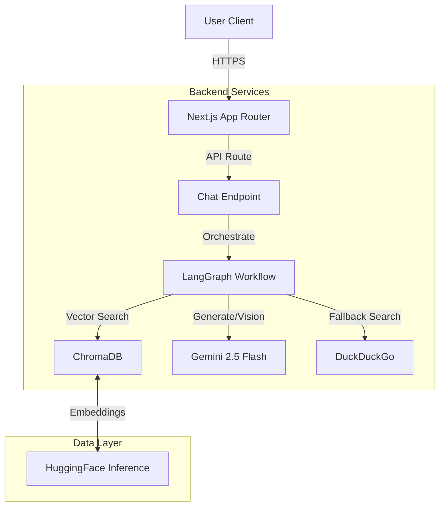
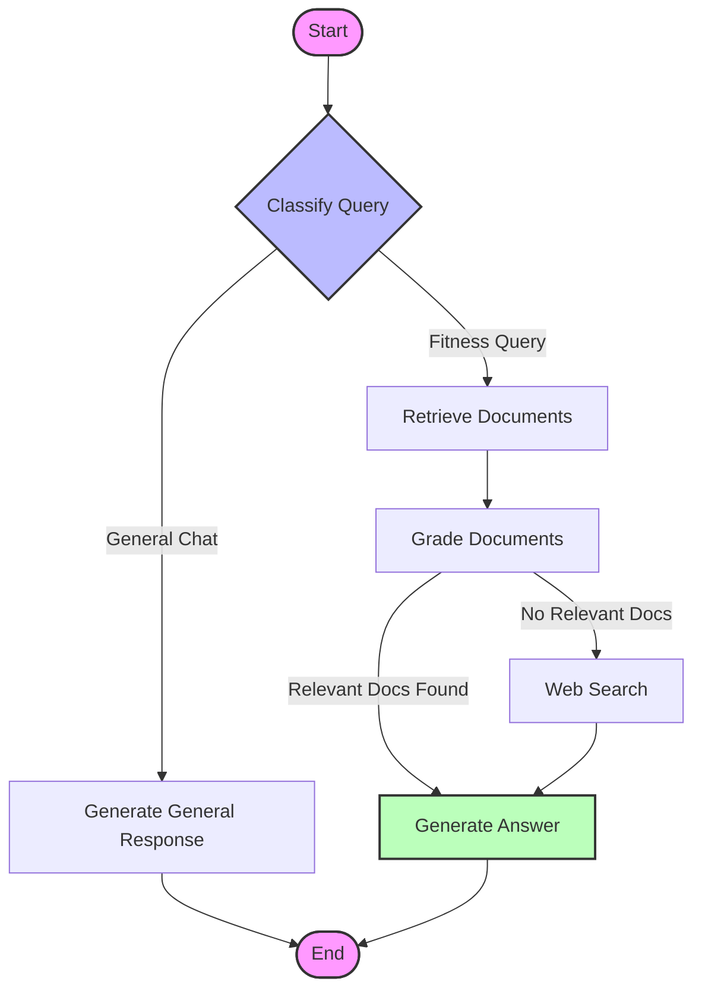

# Zenletics AI Trainer


> **Your Personal AI-Powered Fitness Coach.**  
> Intelligent workout planning, real-time form analysis, and science-backed nutrition advice—all powered by advanced RAG and Multimodal AI.

## 🚀 Overview

Zenletics is a cutting-edge fitness application that leverages the power of Generative AI to provide personalized health and wellness guidance. Unlike standard fitness apps, Zenletics uses a **Self-Reflective Retrieval Augmented Generation (Self-RAG)** engine to ensure advice is accurate, context-aware, and scientifically grounded.

It combines **Google Gemini 2.5 Flash** for high-speed reasoning and vision capabilities with **ChromaDB** for vector storage, creating a system that "thinks" before it answers.

## ✨ Key Features

-   **🧠 Self-Correcting AI Coach**: Uses a LangGraph-based Self-RAG workflow to retrieve, grade, and verify information before responding.
-   **👁️ Multimodal Form Analysis**: Upload photos of your workout form, and the AI (powered by Gemini Vision) will analyze your posture and suggest corrections.
-   **🏋️ Personalized Plans**: Generates custom workout and nutrition plans based on your unique goals, biometrics, and equipment availability.
-   **⚡ Real-Time Streaming**: Experience zero-latency conversations with streaming responses.
-   **🔍 Smart Web Search Fallback**: If the internal knowledge base is insufficient, the system autonomously performs a privacy-focused web search (DuckDuckGo) to find the latest information.

## 🛠️ Tech Stack

### Frontend
-   **Framework**: [Next.js 16](https://nextjs.org/) (App Router, Turbopack)
-   **Styling**: [TailwindCSS](https://tailwindcss.com/) v4 & [Shadcn/UI](https://ui.shadcn.com/)
-   **State Management**: React Hooks & Server Actions

### Backend & AI
-   **LLM**: Google Gemini 2.5 Flash
-   **Orchestration**: [LangGraph](https://langchain-ai.github.io/langgraph/) (Stateful Agents)
-   **Vector Database**: [ChromaDB](https://www.trychroma.com/) (Cloud Client)
-   **Embeddings**: HuggingFace (`sentence-transformers/all-MiniLM-L6-v2`)
-   **Search**: DuckDuckGo Search API

## 🏗️ System Architecture

The system follows a modern serverless architecture leveraging Next.js API routes as the backend controller.



## 🔄 RAG Pipeline Flow

The core intelligence of Zenletics lies in its **Self-RAG** pipeline. This workflow ensures high-quality responses by grading retrieved documents and deciding whether to use internal knowledge or fetch external data.



### Pipeline Steps:
1.  **Classify**: The AI determines if the query is fitness-related or general conversation.
2.  **Retrieve**: Fetches relevant documents from ChromaDB using semantic search.
3.  **Grade**: A specialized "Grader Agent" evaluates if the retrieved documents actually answer the user's question.
4.  **Decide**:
    *   If documents are **relevant**, generate an answer immediately.
    *   If documents are **irrelevant** or missing, trigger a **Web Search** to get fresh data.
5.  **Generate**: Synthesizes the final answer using the best available context (internal or external).

## 🚀 Getting Started

### Prerequisites
-   Node.js 18+
-   npm or pnpm
-   Google Gemini API Key
-   ChromaDB Cloud Credentials

### Installation

1.  **Clone the repository**
    ```bash
    git clone https://github.com/yourusername/zenletics.git
    cd zenletics
    ```

2.  **Install dependencies**
    ```bash
    npm install
    ```

3.  **Set up Environment Variables**
    Create a `.env` file in the root directory:
    ```env
    # AI Keys
    GEMINI_API_KEY=your_gemini_key
    HF_API_KEY=your_huggingface_key
    
    # Database
    CHROMA_API_KEY=your_chroma_key
    CHROMA_TENANT_ID=your_tenant_id
    CHROMA_DATABASE=your_database_name
    ```

4.  **Run the Development Server**
    ```bash
    npm run dev
    ```
    Open [http://localhost:3000](http://localhost:3000) to see the app.

## 🤝 Contributing

Contributions are welcome! Please feel free to submit a Pull Request.

1.  Fork the Project
2.  Create your Feature Branch (`git checkout -b feature/AmazingFeature`)
3.  Commit your Changes (`git commit -m 'Add some AmazingFeature'`)
4.  Push to the Branch (`git push origin feature/AmazingFeature`)
5.  Open a Pull Request

## 📄 License

Distributed under the MIT License. See `LICENSE` for more information.