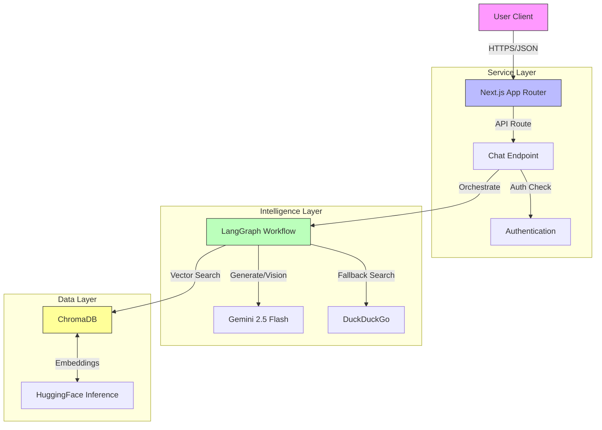
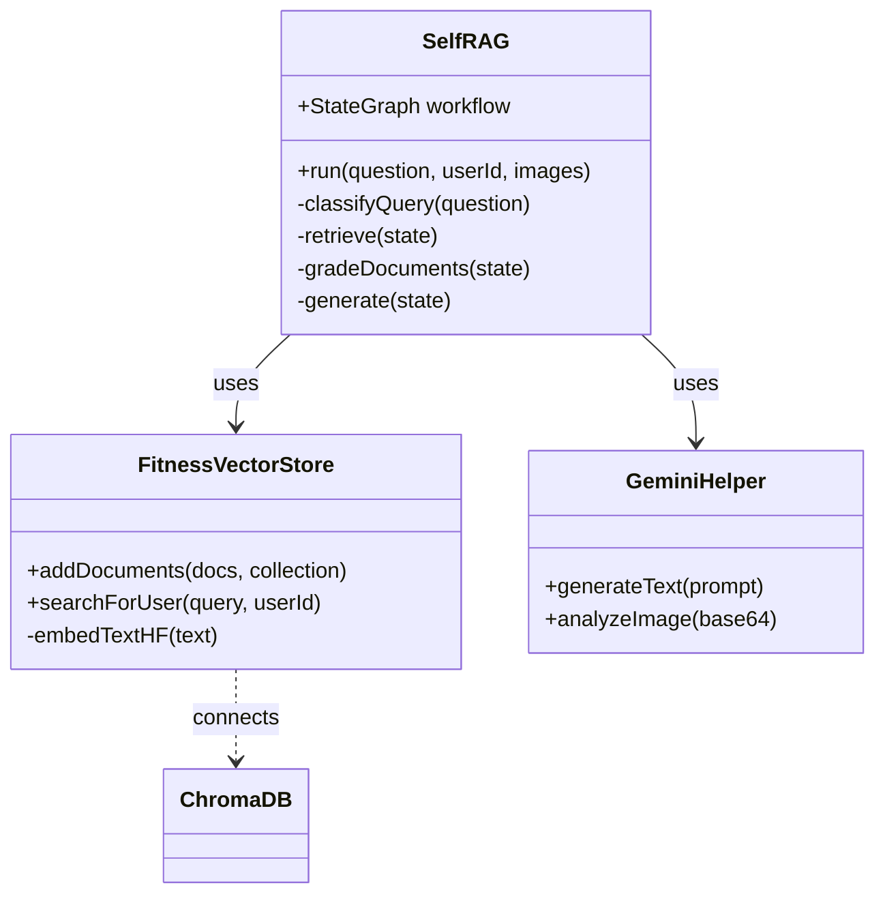

# Zenletics AI Trainer


> **Your Personal AI-Powered Fitness Coach.**  
> Intelligent workout planning, real-time form analysis, and science-backed nutrition advice—all powered by advanced RAG and Multimodal AI.

---

## � Table of Contents
- [Overview](#-overview)
- [Key Features](#-key-features)
- [System Architecture (HLD)](#-system-architecture-hld)
- [Low-Level Design (LLD)](#-low-level-design-lld)
- [Data Flow](#-data-flow)
- [Tech Stack](#-tech-stack)
- [Getting Started](#-getting-started)
- [API Reference](#-api-reference)

---

## �🚀 Overview

Zenletics is a cutting-edge fitness application that leverages the power of Generative AI to provide personalized health and wellness guidance. Unlike standard fitness apps, Zenletics uses a **Self-Reflective Retrieval Augmented Generation (Self-RAG)** engine to ensure advice is accurate, context-aware, and scientifically grounded.

It combines **Google Gemini 2.5 Flash** for high-speed reasoning and vision capabilities with **ChromaDB** for vector storage, creating a system that "thinks" before it answers.

---

## ✨ Key Features

-   **🧠 Self-Correcting AI Coach**: Uses a LangGraph-based Self-RAG workflow to retrieve, grade, and verify information before responding.
-   **👁️ Multimodal Form Analysis**: Upload photos of your workout form, and the AI (powered by Gemini Vision) will analyze your posture and suggest corrections.
-   **🏋️ Personalized Plans**: Generates custom workout and nutrition plans based on your unique goals, biometrics, and equipment availability.
-   **⚡ Real-Time Streaming**: Experience zero-latency conversations with streaming responses.
-   **🔍 Smart Web Search Fallback**: If the internal knowledge base is insufficient, the system autonomously performs a privacy-focused web search (DuckDuckGo) to find the latest information.

---

## 🏗️ System Architecture (HLD)

The system follows a modern **Serverless Microservices** architecture pattern, leveraging Next.js API routes as the primary controller layer.

### High-Level Components

1.  **Client Layer**: A responsive React application (Next.js) handling UI/UX, state management, and real-time updates.
2.  **Service Layer**: Next.js API Routes acting as the orchestration layer, managing authentication, request validation, and routing to AI services.
3.  **Intelligence Layer**: The core brain of the application, consisting of LangGraph agents and Gemini LLMs.
4.  **Data Layer**: 
    -   **ChromaDB**: Stores vector embeddings of fitness knowledge and user history.
    -   **HuggingFace**: Provides inference for text embeddings.
    -   **DuckDuckGo**: External knowledge source for fallback retrieval.

### Architecture Diagram



---

## � Low-Level Design (LLD)

### Core Modules

#### 1. Self-RAG Engine (`lib/ai-trainer/self-rag.ts`)
The central nervous system of the AI trainer. It implements a state machine using `LangGraph`.

*   **State**: Tracks `question`, `documents`, `generation`, `retryCount`, and `isFitnessQuery`.
*   **Nodes**:
    *   `retrieve`: Fetches docs from VectorStore.
    *   `grade`: Evaluates doc relevance using Gemini.
    *   `webSearch`: Fallback to DDG if docs are poor.
    *   `generate`: Synthesizes final answer.

#### 2. Vector Store (`lib/ai-trainer/vector-store.ts`)
Manages interactions with ChromaDB.

*   **Pattern**: Singleton.
*   **Collections**:
    *   `fitness_global_knowledge`: Shared verified fitness data.
    *   `fitness_user_{userId}`: Personalized user data.
*   **Embedding**: Uses `sentence-transformers/all-MiniLM-L6-v2` via HuggingFace Inference API.

#### 3. Multimodal Processor (`lib/ai-trainer/multimodal.ts`)
Handles image inputs for form correction.

*   **Input**: Base64 image strings.
*   **Process**: Sends to Gemini Vision model with specific "Form Analysis" system prompts.
*   **Output**: Textual critique and correction suggestions.

### Class Diagram



---

## 🔄 Data Flow

The following sequence describes the lifecycle of a user request, from input to response.

### Request Lifecycle

1.  **User Input**: User sends a text message (and optionally an image) via the Chat UI.
2.  **API Handling**: `POST /api/ai-trainer/chat` receives the payload.
3.  **Classification**: The system first classifies the intent:
    *   *General*: "Hi", "How are you?" -> Direct LLM response.
    *   *Fitness*: "How to do a deadlift?", "Fix my form" -> Enters RAG Pipeline.
4.  **RAG Execution**:
    *   **Retrieve**: System converts query to vector -> Searches ChromaDB.
    *   **Grade**: LLM checks if retrieved docs match the query.
    *   **Decide**: If docs are good -> Generate. If bad -> Web Search.
5.  **Generation**: LLM generates a response using the retrieved context and specific fitness persona instructions.
6.  **Response**: JSON payload returned to client (or streamed).

### RAG Pipeline Flowchart


---

## 🛠️ Tech Stack

### Frontend
-   **Framework**: [Next.js 16](https://nextjs.org/) (App Router, Turbopack)
-   **Styling**: [TailwindCSS](https://tailwindcss.com/) v4 & [Shadcn/UI](https://ui.shadcn.com/)
-   **State Management**: React Hooks & Server Actions

### Backend & AI
-   **LLM**: Google Gemini 2.5 Flash
-   **Orchestration**: [LangGraph](https://langchain-ai.github.io/langgraph/) (Stateful Agents)
-   **Vector Database**: [ChromaDB](https://www.trychroma.com/) (Cloud Client)
-   **Embeddings**: HuggingFace (`sentence-transformers/all-MiniLM-L6-v2`)
-   **Search**: DuckDuckGo Search API

---

## 🚀 Getting Started

### Prerequisites
-   Node.js 18+
-   npm or pnpm
-   Google Gemini API Key
-   ChromaDB Cloud Credentials

### Installation

1.  **Clone the repository**
    ```bash
    git clone https://github.com/yourusername/zenletics.git
    cd zenletics
    ```

2.  **Install dependencies**
    ```bash
    npm install
    ```

3.  **Set up Environment Variables**
    Create a `.env` file in the root directory:
    ```env
    # AI Keys
    GEMINI_API_KEY=your_gemini_key
    HF_API_KEY=your_huggingface_key
    
    # Database
    CHROMA_API_KEY=your_chroma_key
    CHROMA_TENANT_ID=your_tenant_id
    CHROMA_DATABASE=your_database_name
    ```

4.  **Run the Development Server**
    ```bash
    npm run dev
    ```
    Open [http://localhost:3000](http://localhost:3000) to see the app.

---

## 📡 API Reference

### Chat Endpoint

**URL**: `/api/ai-trainer/chat`  
**Method**: `POST`

**Request Body**
```json
{
  "message": "How do I improve my bench press?",
  "userId": "user_123",
  "images": ["base64_string_optional"],
  "conversationId": "conv_abc"
}
```

**Response**
```json
{
  "response": "To improve your bench press, focus on...",
  "sources": [
    { "content": "...", "score": 0.89 }
  ],
  "conversationId": "conv_abc"
}
```

---

## 📄 License

Distributed under the MIT License. See `LICENSE` for more information.