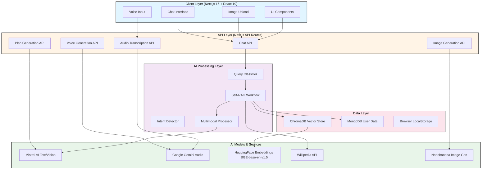
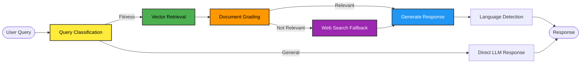
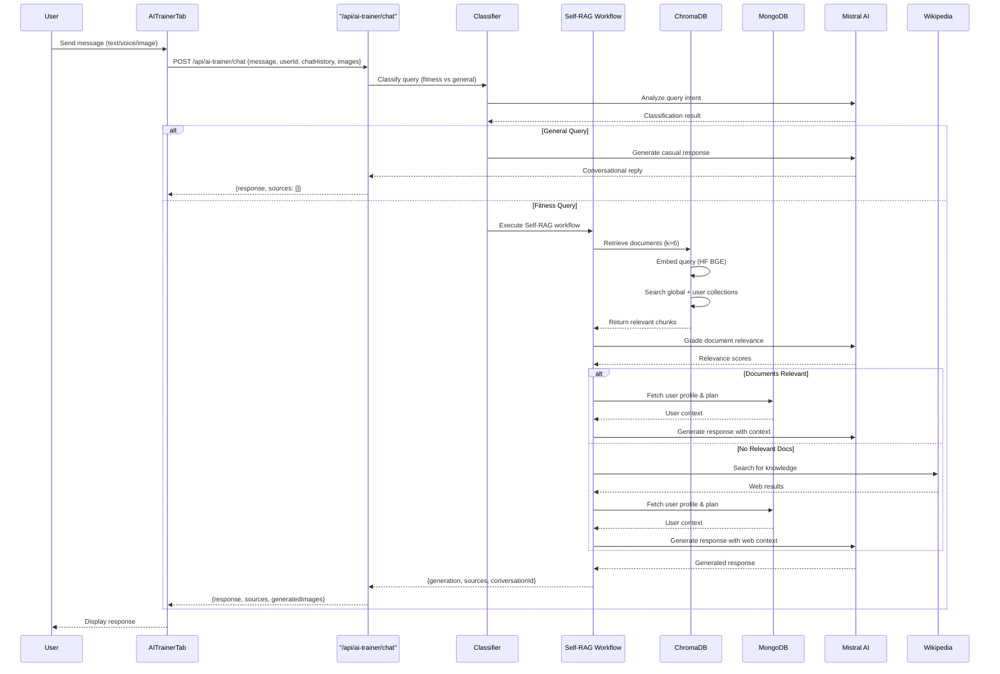
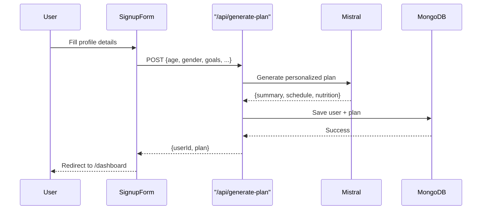
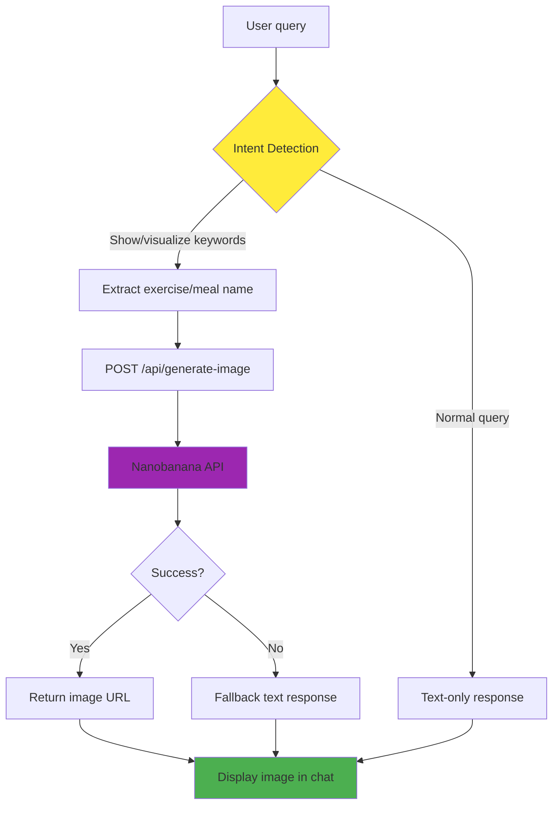

# ZenFit - AI-Powered Personal Fitness & Nutrition Platform

[](https://nextjs.org/)
[](https://www.typescriptlang.org/)
[](LICENSE)

> An intelligent fitness platform featuring AI-powered personalized training plans, multimodal interactions (voice, image, text), and a Self-RAG (Retrieval Augmented Generation) chatbot for comprehensive fitness guidance.

---

## 📋 Table of Contents

- [Overview](#overview)
- [System Architecture](#system-architecture)
- [High-Level Design (HLD)](#high-level-design-hld)
- [Low-Level Design (LLD)](#low-level-design-lld)
- [Core Features](#core-features)
- [Technology Stack](#technology-stack)
- [RAG Pipeline Architecture](#rag-pipeline-architecture)
- [AI Models & Services](#ai-models--services)
- [API Documentation](#api-documentation)
- [Setup & Installation](#setup--installation)
- [Environment Variables](#environment-variables)
- [Project Structure](#project-structure)
- [Data Flow Diagrams](#data-flow-diagrams)
- [Security & Best Practices](#security--best-practices)

---

## 🔍 Overview

ZenFit is a next-generation fitness platform that leverages cutting-edge AI technologies to provide personalized fitness and nutrition guidance. The platform combines:

- **Self-RAG Chatbot**: Intelligent conversational AI with retrieval-augmented generation using **Mistral AI**.
- **Multimodal Interactions**: Support for text, voice (Gemini), and image analysis (Mistral Vision).
- **Vector Search**: ChromaDB-powered semantic search for fitness knowledge retrieval.
- **Personalized Plans**: AI-generated workout and meal plans based on user profiles.
- **Real-time Progress Tracking**: Milestone tracking and analytics.
- **Multilingual Support**: Responds in the user's query language.

---

## 🏗️ System Architecture



---

## 📐 High-Level Design (HLD)

### System Components

#### 1. **Frontend Layer**
- **Framework**: Next.js 16 with React 19 and TypeScript
- **UI Library**: Radix UI components with TailwindCSS
- **State Management**: React hooks with localStorage persistence
- **Real-time Updates**: Client-side chat history management

#### 2. **API Gateway Layer**
- **Next.js API Routes**: RESTful endpoints
- **Authentication**: User ID-based sessions
- **Request Validation**: Zod schema validation
- **Error Handling**: Centralized error responses

#### 3. **AI Processing Layer**

##### Self-RAG Workflow (LangGraph)


#### 4. **Data Persistence Layer**
- **Vector Database**: ChromaDB for semantic search (with custom embedding function)
- **Document Database**: MongoDB for user profiles & fitness plans
- **Caching**: Browser localStorage for chat history & user sessions

---

## 🔬 Low-Level Design (LLD)

### Self-RAG Pipeline Implementation

```typescript
interface SelfRAGState {
  question: string          // User's input query
  generation: string        // Generated response
  documents: string[]       // Retrieved context documents
  webSearch: boolean        // Fallback trigger flag
  retryCount: number        // Web search retry counter
}

class SelfRAGWorkflow {
  // Node 1: Retrieve from vector database
  async retrieve(state: SelfRAGState, userId?: string): Promise<Partial<SelfRAGState>>
  
  // Node 2: Grade document relevance (Mistral)
  async gradeDocuments(state: SelfRAGState): Promise<Partial<SelfRAGState>>
  
  // Node 3: Fallback web search (Wikipedia)
  async webSearch(state: SelfRAGState): Promise<Partial<SelfRAGState>>
  
  // Node 4: Generate final response (Mistral)
  async generate(state: SelfRAGState, userId?: string, chatHistory?: ChatMessage[]): Promise<Partial<SelfRAGState>>
}
```

### Vector Store Architecture

```typescript
class FitnessVectorStore {
  // Collections
  - fitness_global_knowledge    // Shared fitness knowledge base
  - fitness_user_{userId}        // User-specific documents
  
  // Custom Embedding Function (Serverless Safe)
  class GeminiEmbeddingFunction implements IEmbeddingFunction {
    generate(texts: string[]): Promise<number[][]> // Uses HF BGE-base-en-v1.5
  }
  
  // Operations
  + addGlobalDocuments(docs: Document[]): Promise<string[]>
  + addUserDocuments(userId: string, docs: Document[]): Promise<string[]>
  + searchForUser(query: string, userId?: string, k: number): Promise<Document[]>
}
```

### Multimodal Processor

```typescript
class MultimodalProcessor {
  // Image Analysis (Mistral Vision)
  + analyzeExerciseForm(imageBase64: string): Promise<string>
  + describeImage(imageBase64: string): Promise<string>
  
  // Image Generation (Nanobanana)
  + generateExerciseImage(exerciseName: string, instructions?: string): Promise<string>
  
  // Audio Transcription (Gemini)
  + transcribeAudio(audioBase64: string, mimeType: string): Promise<string>
  
  // Intent Detection
  + shouldGenerateImage(query: string): boolean
  + extractExerciseName(query: string): string
}
```

---

## ✨ Core Features

### 1. **AI-Powered Chat Interface**
- **Self-RAG Architecture**: Retrieval-Augmented Generation with grading
- **Context-Aware Responses**: Considers user profile, fitness plans, and chat history
- **Multilingual Support**: Auto-detects and responds in user's language
- **Source Attribution**: Shows relevant documents used in response generation

### 2. **Multimodal Interactions**

#### Voice Input
- **Speech-to-Text**: **Gemini-powered** audio transcription
- **Language Detection**: Automatic language identification
- **Seamless Integration**: Transcribed text populates chat input

#### Image Processing
- **Form Analysis**: **Mistral Vision** powered exercise form evaluation
- **Image Generation**: **Nanobanana** powered exercise/meal visualization
- **Intent Detection**: Automatic image request classification

### 3. **Personalized Fitness Planning**
- **AI-Generated Plans**: Customized workout and nutrition plans via **Mistral AI**
- **User Profiling**: Age, gender, goals, fitness level, dietary preferences
- **Plan Storage**: MongoDB persistence with vector indexing
- **Progress Tracking**: Milestone creation and sharing

### 4. **Knowledge Management**
- **Dual Vector Collections**: Global knowledge + per-user personalization
- **Semantic Search**: Embedding-based similarity matching
- **Web Search Fallback**: **Wikipedia API** integration for missing knowledge
- **Document Grading**: LLM-powered relevance scoring

---

## 🛠️ Technology Stack

### Frontend
| Technology | Version | Purpose |
|------------|---------|---------|
| Next.js | 16.0.0 | React framework with SSR |
| React | 19.2.0 | UI library |
| TypeScript | 5.x | Type safety |
| TailwindCSS | 4.1.9 | Styling |
| Radix UI | Various | Accessible components |
| Framer Motion | 12.23.24 | Animations |

### Backend & AI
| Technology | Version | Purpose |
|------------|---------|---------|
| LangChain | 0.3.36 | AI orchestration |
| LangGraph | 0.2.74 | Workflow engine |
| Mistral AI | mistral-small | Text generation & Vision |
| Google Gemini | 2.0 Flash | Audio transcription |
| HuggingFace | BGE-base-en-v1.5 | Text embeddings |
| ChromaDB | 3.1.6 | Vector database |
| MongoDB | 6.20.0 | Document database |
| Nanobanana | Latest | Image generation |
| Wikipedia API | v1 | Web search fallback |

### Development Tools
- **Build**: Turbopack (Next.js 16)
- **Linting**: ESLint
- **Package Manager**: npm
- **Deployment**: Vercel-ready

---

## 🤖 RAG Pipeline Architecture

### Complete Chat Flow



### Retrieval Workflow Details

#### Step 1: Query Embedding
- **Model**: `BAAI/bge-base-en-v1.5` via HuggingFace
- **Dimensions**: 768
- **Endpoint**: `https://router.huggingface.co/hf-inference/models/BAAI/bge-base-en-v1.5/pipeline/feature-extraction`

#### Step 2: Vector Search
- **Database**: ChromaDB (HTTP client mode)
- **Collections**:
  - `fitness_global_knowledge`: Shared knowledge base
  - `fitness_user_{userId}`: User-specific training data
- **Top-K**: 6 documents
- **Similarity**: Cosine distance

#### Step 3: Document Grading
- **Grader**: Mistral AI
- **Prompt**: Binary relevance classification (yes/no)
- **Threshold**: Explicit "yes" match
- **Fallback**: Web search if all documents irrelevant

#### Step 4: Response Generation
- **Context Assembly**:
  - User profile (age, gender, goals, fitness level)
  - Current fitness plan summary
  - Retrieved documents (up to 6)
  - Chat history (last 10 messages)
  - Web search results (if applicable)
- **Prompt Engineering**:
  - Role: Expert AI fitness trainer
  - Instructions: Personalized, actionable, encouraging
  - Language Detection: **MUST** respond in user's language
  - Length: 200-300 words

---

## 🧠 AI Models & Services

### 1. Mistral AI (Text & Vision)

**Use Cases**:
- Query classification
- Document relevance grading
- Final response generation
- Exercise form analysis (Vision)

**Configuration**:
```typescript
const ai = new Mistral({
  apiKey: process.env.MISTRAL_API_KEY!
})
```

### 2. Google Gemini (Audio)

**Use Cases**:
- Audio transcription (Speech-to-Text)

**Configuration**:
```typescript
const gemini = new ChatGoogleGenerativeAI({
  apiKey: process.env.GEMINI_API_KEY!,
  model: 'gemini-2.0-flash-exp',
})
```

### 3. HuggingFace BGE-base-en-v1.5

**Purpose**: Text embedding for semantic search

**Specifications**:
- **Model**: `BAAI/bge-base-en-v1.5`
- **Dimensions**: 768
- **Max Tokens**: 512

### 4. Wikipedia API (Web Search)

**Purpose**: Web search fallback when vector DB has no relevant docs. Replaced DuckDuckGo for better reliability.

**Implementation**:
```typescript
const res = await fetch(
  `https://en.wikipedia.org/w/api.php?action=query&list=search&srsearch=${query}&format=json`
);
```

---

## 📡 API Documentation

### Chat Endpoint

#### `POST /api/ai-trainer/chat`

**Description**: Main chatbot endpoint with Self-RAG pipeline

**Request Body**:
```typescript
{
  message: string              // User's query
  userId: string               // User identifier
  images?: string[]            // Base64 encoded images (optional)
  chatHistory?: Array<{        // Recent conversation (optional)
    role: 'user' | 'assistant'
    content: string
  }>
  conversationId?: string      // Session identifier (optional)
}
```

**Response**:
```typescript
{
  response: string             // Generated answer
  sources: Array<{             // Retrieved context documents
    content: string
    score: number
    metadata: object
  }>
  generatedImages: string[]    // URLs to generated images
  conversationId: string       // Session identifier
}
```

---

## 🚀 Setup & Installation

### Prerequisites

- **Node.js**: v18.0.0 or higher
- **npm**: v9.0.0 or higher
- **MongoDB**: v6.0 or higher (cloud or local)
- **ChromaDB**: HTTP server running on port 8000

### 1. Clone Repository

```bash
git clone https://github.com/your-username/zenfit.git
cd zenfit
```

### 2. Install Dependencies

```bash
npm install
```

### 3. Setup ChromaDB (Local)

```bash
# Option 1: Docker
docker pull chromadb/chroma
docker run -p 8000:8000 chromadb/chroma

# Option 2: pip
pip install chromadb
chroma run --host localhost --port 8000
```

### 4. Configure Environment Variables

Create `.env` file in root directory:

```env
# See Environment Variables section below
```

### 5. Run Development Server

```bash
npm run dev
```

Open [http://localhost:3000](http://localhost:3000)

### 6. Build for Production

```bash
npm run build
npm start
```

---

## 🔐 Environment Variables

Create a `.env` file with the following variables:

```env
# Mistral AI (Text & Vision)
MISTRAL_API_KEY=your_mistral_api_key_here

# Google Gemini API (Audio Transcription)
GEMINI_API_KEY=your_gemini_api_key_here

# HuggingFace API (Embeddings)
HF_API_KEY=your_huggingface_api_key_here

# Nanobanana API (Image Generation)
NANOBANANA_API_KEY=your_nanobanana_api_key_here

# ChromaDB Configuration
CHROMA_HTTP_HOST=localhost
CHROMA_HTTP_PORT=8000
CHROMA_API_KEY=your_chroma_api_key
CHROMA_TENANT_ID=default_tenant
CHROMA_DATABASE=default_database

# MongoDB Connection
MONGODB_URI=mongodb://localhost:27017/zenfit

# Next.js Configuration
NEXT_PUBLIC_APP_URL=http://localhost:3000
```

### API Key Setup Instructions

1. **Mistral AI**: [Get API Key](https://console.mistral.ai/)
2. **Google Gemini**: [Get API Key](https://makersuite.google.com/app/apikey)
3. **HuggingFace**: [Create Token](https://huggingface.co/settings/tokens)
4. **Nanobanana**: [Sign Up](https://nanobanana.ai)
5. **MongoDB Atlas**: [Create Cluster](https://www.mongodb.com/cloud/atlas)

---

## 📂 Project Structure

```
zenfit/
├── app/                              # Next.js app directory
│   ├── api/                          # API routes
│   │   ├── ai-trainer/
│   │   │   ├── chat/route.ts        # Main chat endpoint (Self-RAG)
│   │   │   └── documents/route.ts   # Document management
│   │   ├── transcribe/route.ts      # Audio transcription
│   │   ├── generate-image/route.ts  # Image generation
│   │   ├── generate-plan/route.ts   # Fitness plan generation
│   │   ├── generate-voice/route.ts  # Text-to-speech
│   │   └── milestones/route.ts      # Milestone CRUD
│   ├── dashboard/page.tsx           # User dashboard
│   ├── login/page.tsx               # Login page
│   ├── signup/page.tsx              # Signup page
│   └── page.tsx                     # Landing page
├── components/                       # React components
│   ├── ai-trainer-tab.tsx           # Main chat interface
│   ├── plan-tab.tsx                 # Fitness plan display
│   ├── milestones-tab.tsx           # Progress tracking
│   ├── voice-player.tsx             # Audio playback
│   └── ...                          # Other UI components
├── lib/                              # Core libraries
│   ├── ai-trainer/                  # AI trainer modules
│   │   ├── self-rag.ts              # Self-RAG workflow (LangGraph)
│   │   ├── vector-store.ts          # ChromaDB vector operations
│   │   └── multimodal.ts            # Image & audio processing
│   ├── gemini.ts                    # Mistral/Gemini wrapper
│   ├── chroma.ts                    # ChromaDB client (Custom Embedder)
│   ├── mongodb.ts                   # MongoDB connection
│   ├── ddg.ts                       # Wikipedia search
│   └── storage.ts                   # LocalStorage utilities
├── types/                            # TypeScript definitions
│   └── ai-trainer.ts                # Type interfaces
├── scripts/                          # Utility scripts
│   └── fix-chroma.js                # Post-install fix
├── public/                           # Static assets
├── .env.example                     # Environment template
├── package.json                     # Dependencies
├── tsconfig.json                    # TypeScript config
├── next.config.ts                   # Next.js config
└── README.md                        # This file
```

---

## 📊 Data Flow Diagrams

### User Signup & Plan Generation



### Voice Input Flow

```mermaid
graph LR
    A[User clicks Mic] --> B[MediaRecorder starts]
    B --> C[User speaks]
    C --> D[User stops recording]
    D --> E[Audio Blob created]
    E --> F["POST /api/transcribe"]
    F --> G[Gemini processes audio]
    G --> H[Return transcribed text]
    H --> I[Populate input field]
    I --> J[User sends message]

    style A fill:#4caf50
    style G fill:#2196f3
    style H fill:#ff9800
```



### Image Generation Flow



---

## 🔒 Security & Best Practices

### Security Measures

1. **API Key Management**
   - All sensitive keys stored in `.env`
   - Never committed to version control (`.gitignore`)
   - Server-side API calls only (no client-side exposure)

2. **Input Validation**
   - Zod schemas for request validation
   - SQL injection prevention (MongoDB parameterized queries)
   - XSS protection (React's built-in escaping)

3. **Authentication**
   - User ID-based session management
   - LocalStorage for client-side persistence
   - Server-side validation on every request

4. **Rate Limiting**
   - Recommended: Implement per-user rate limits
   - Use Vercel's built-in DDoS protection

### Best Practices

1. **Error Handling**
   - Centralized error logging
   - User-friendly error messages
   - Fallback mechanisms (web search, default responses)

2. **Performance Optimization**
   - Text chunking for large documents (800 chars, 150 overlap)
   - Lazy loading of vector collections
   - Chat history truncation (last 10 messages)

3. **Data Privacy**
   - User-specific vector collections
   - No cross-user data leakage
   - Mongodb user collection isolation

4. **Code Quality**
   - TypeScript for type safety
   - ESLint for code linting
   - Modular architecture (separation of concerns)

---

## 🧪 Testing

### Run Linter

```bash
npm run lint
```

### Manual Testing Checklist

- [ ] User signup with fitness plan generation
- [ ] Chat with text queries (fitness & general)
- [ ] Voice input recording and transcription
- [ ] Image upload for form analysis
- [ ] Image generation request ("show me pushups")
- [ ] Multilingual responses (Hindi, Spanish, etc.)
- [ ] Chat history persistence
- [ ] Milestone creation and display
- [ ] Tab switching (Plan, Milestones, AI Trainer)

---

## 🚀 Deployment

### Vercel Deployment

1. **Connect Repository**
   ```bash
   vercel --prod
   ```

2. **Add Environment Variables**
   - Go to Vercel Dashboard > Settings > Environment Variables
   - Add all variables from `.env`

3. **Deploy**
   ```bash
   git push origin main
   ```

### MongoDB Atlas Setup

1. Create a free cluster at [MongoDB Atlas](https://www.mongodb.com/cloud/atlas)
2. Whitelist Vercel IP ranges (or allow all IPs for testing)
3. Copy connection string to `MONGODB_URI`

### ChromaDB Cloud Setup

For production, consider:
- [Chroma Cloud](https://www.trychroma.com/) (managed service)
- Self-hosted on AWS/GCP with persistent storage
- Update `CHROMA_HTTP_HOST` and `CHROMA_HTTP_PORT` accordingly

---

## 🤝 Contributing

Contributions are welcome! Please follow these steps:

1. Fork the repository
2. Create a feature branch (`git checkout -b feature/AmazingFeature`)
3. Commit your changes (`git commit -m 'Add some AmazingFeature'`)
4. Push to the branch (`git push origin feature/AmazingFeature`)
5. Open a Pull Request

---

## 📄 License

This project is licensed under the MIT License - see the [LICENSE](LICENSE) file for details.

---

## 🙏 Acknowledgments

- **Mistral AI** for powerful LLM & Vision capabilities
- **Google Gemini** for audio transcription
- **HuggingFace** for open-source embeddings
- **ChromaDB** for vector database infrastructure
- **LangChain/LangGraph** for AI orchestration
- **Radix UI** for accessible components
- **Vercel** for seamless deployment

---

## 📞 Contact & Support

- **Developer**: Nehil Chandrakar
- **Email**: nehil.contact@gmail.com
- **GitHub**: [@NEhiL06](https://github.com/NEhiL06)
- **Issues**: [GitHub Issues](https://github.com/NEhiL06/zenfit/issues)

---

**Built with ❤️ using Next.js, TypeScript, and cutting-edge AI technologies**