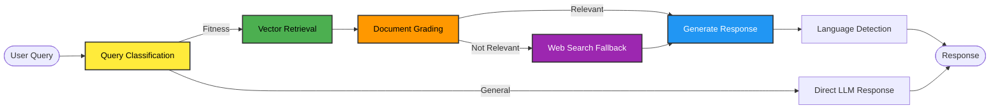
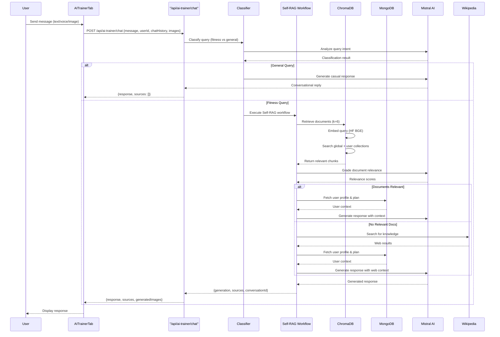
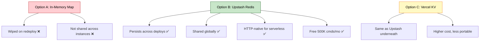
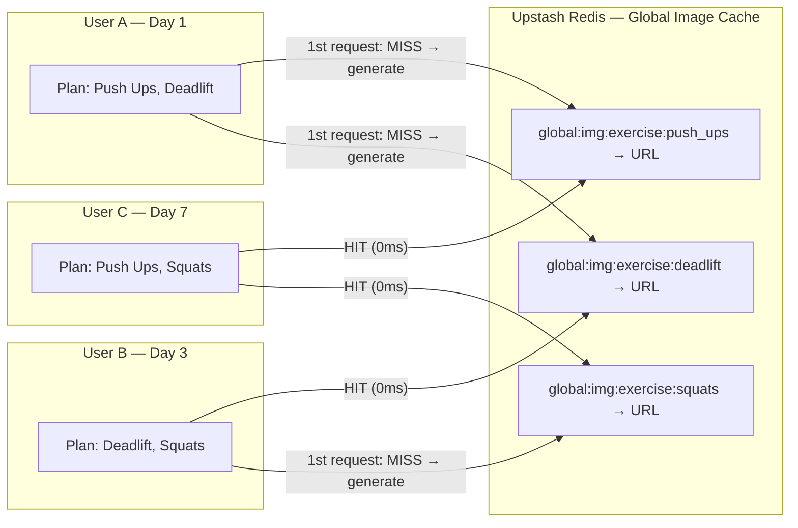
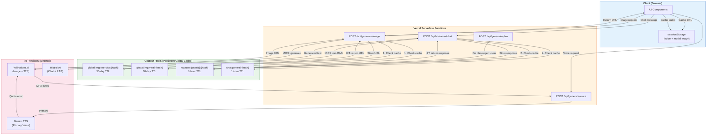
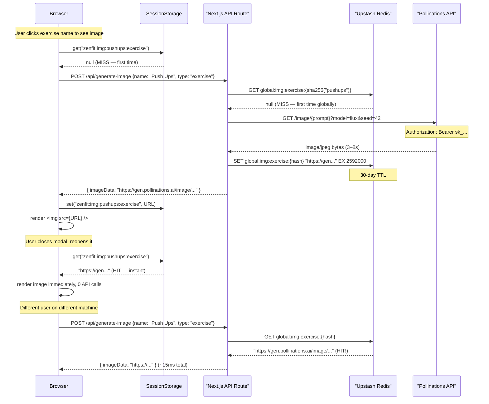
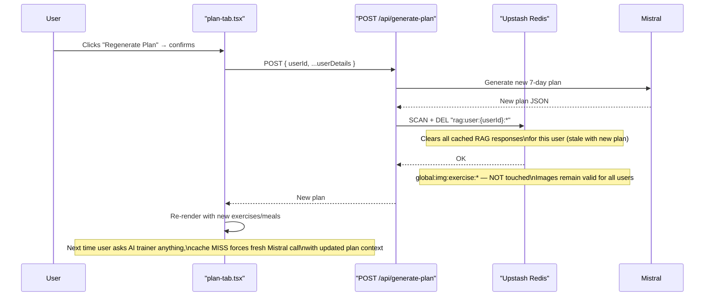
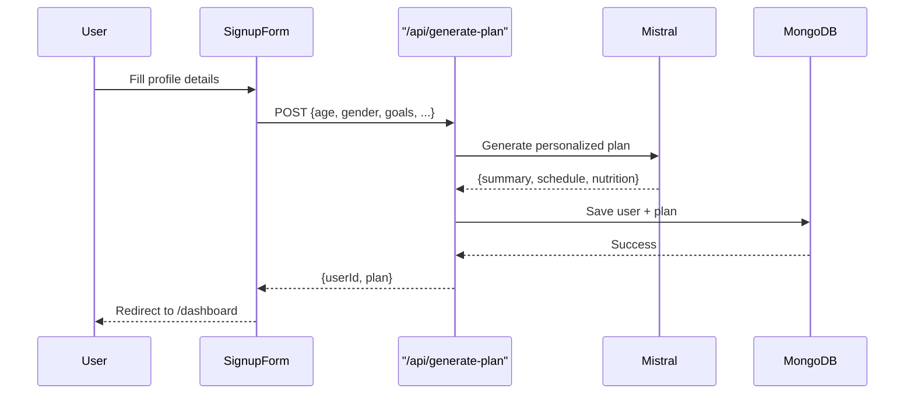
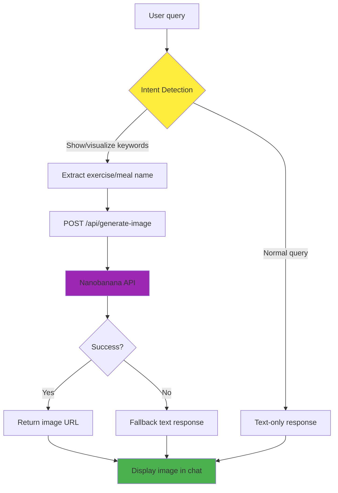

# ZenFit - AI-Powered Personal Fitness & Nutrition Platform

[](https://nextjs.org/)
[](https://www.typescriptlang.org/)
[](LICENSE)

> An intelligent fitness platform featuring AI-powered personalized training plans, multimodal interactions (voice, image, text), and a Self-RAG (Retrieval Augmented Generation) chatbot for comprehensive fitness guidance.

---

## 📋 Table of Contents

- [Overview](#overview)
- [System Architecture](#system-architecture)
- [High-Level Design (HLD)](#high-level-design-hld)
- [Low-Level Design (LLD)](#low-level-design-lld)
- [Core Features](#core-features)
- [Technology Stack](#technology-stack)
- [RAG Pipeline Architecture](#rag-pipeline-architecture)
- [AI Models & Services](#ai-models--services)
- [Caching Architecture](#caching-architecture)
- [API Documentation](#api-documentation)
- [Setup & Installation](#setup--installation)
- [Environment Variables](#environment-variables)
- [Project Structure](#project-structure)
- [Data Flow Diagrams](#data-flow-diagrams)
- [Security & Best Practices](#security--best-practices)


---

## 🔍 Overview

ZenFit is a next-generation fitness platform that leverages cutting-edge AI technologies to provide personalized fitness and nutrition guidance. The platform combines:

- **Self-RAG Chatbot**: Intelligent conversational AI with retrieval-augmented generation using **Mistral AI**.
- **Multimodal Interactions**: Support for text, voice (Gemini), and image analysis (Mistral Vision).
- **Vector Search**: ChromaDB-powered semantic search for fitness knowledge retrieval.
- **Personalized Plans**: AI-generated workout and meal plans based on user profiles.
- **Real-time Progress Tracking**: Milestone tracking and analytics.
- **Multilingual Support**: Responds in the user's query language.

---

## 🏗️ System Architecture


```mermaid
graph TB
    subgraph Client["Client Layer (Next.js 16 + React 19)"]
        UI[UI Components]
        Voice[Voice Input]
        Image[Image Upload]
        Chat[Chat Interface]
        SS["sessionStorage\nimage + voice mini-cache"]
    end

    subgraph API["API Layer (Next.js API Routes)"]
        ChatAPI["Chat API"]
        PlanAPI["Plan Generation API"]
        ImageAPI["Image Generation API"]
        TranscribeAPI["Audio Transcription API"]
        VoiceAPI["Voice Generation API"]
    end

    subgraph Cache["Cache Layer (Upstash Redis)"]
        RImgEx["global:img:exercise:{hash} · 30d"]
        RImgMl["global:img:meal:{hash} · 30d"]
        RRag["rag:user:{id}:{hash} · 1h"]
        RChat["chat:general:{hash} · 1h"]
    end

    subgraph AILayer["AI Processing Layer"]
        SelfRAG[Self-RAG Workflow]
        Classifier[Query Classifier]
        Multimodal[Multimodal Processor]
    end

    subgraph Models["AI Models & Services"]
        Mistral["Mistral AI\nText + Vision"]
        Gemini["Google Gemini\nTTS + Transcription"]
        Pollinations["Pollinations.ai\nImage + TTS fallback"]
        HF["HuggingFace\nBGE-base-en-v1.5"]
        Wiki[Wikipedia API]
    end

    subgraph DataLayer["Data Layer"]
        Chroma[ChromaDB Vector Store]
        MongoDB[MongoDB User Data]
    end

    UI --> ChatAPI
    UI --> ImageAPI
    Voice --> TranscribeAPI
    Image --> ChatAPI
    Chat --> ChatAPI

    ImageAPI --> RImgEx
    ImageAPI --> RImgMl
    RImgEx -->|HIT| ImageAPI
    ImageAPI -->|MISS| Pollinations
    ImageAPI -->|Store| RImgEx
    ImageAPI --> SS

    ChatAPI --> Classifier
    ChatAPI --> RRag
    ChatAPI --> RChat
    RRag -->|HIT| ChatAPI
    Classifier --> SelfRAG
    SelfRAG --> Multimodal
    ChatAPI -->|Store| RRag
    PlanAPI -->|Invalidate| RRag

    TranscribeAPI --> Gemini
    VoiceAPI --> Gemini
    Gemini -->|Quota fail| Pollinations
    VoiceAPI --> SS

    SelfRAG --> Chroma
    SelfRAG --> MongoDB
    SelfRAG --> Wiki
    Multimodal --> Mistral
    Chroma --> HF
    PlanAPI --> Mistral

    style Client fill:#e1f5ff,stroke:#333,stroke-width:2px,color:#000000
    style API fill:#fff4e6,stroke:#333,stroke-width:2px,color:#000000
    style Cache fill:#e8f5e9,stroke:#2e7d32,stroke-width:2px,color:#000000
    style AILayer fill:#f3e5f5,stroke:#333,stroke-width:2px,color:#000000
    style Models fill:#fce4ec,stroke:#b71c1c,stroke-width:2px,color:#000000
    style DataLayer fill:#fff8e1,stroke:#f57f17,stroke-width:2px,color:#000000
```

---

## 📐 High-Level Design (HLD)

### System Components

#### 1. **Frontend Layer**
- **Framework**: Next.js 16 with React 19 and TypeScript
- **UI Library**: Radix UI components with TailwindCSS
- **State Management**: React hooks with localStorage persistence
- **Real-time Updates**: Client-side chat history management

#### 2. **API Gateway Layer**
- **Next.js API Routes**: RESTful endpoints
- **Authentication**: User ID-based sessions
- **Request Validation**: Zod schema validation
- **Error Handling**: Centralized error responses

#### 3. **AI Processing Layer**

##### Self-RAG Workflow (LangGraph)

```mermaid
graph LR
    START([User Query]) --> Classify[Query Classification]
    Classify --> |Fitness| Retrieve[Vector Retrieval]
    Classify --> |General| DirectResponse[Direct LLM Response]
    
    Retrieve --> Grade[Document Grading]
    Grade --> |Relevant| Generate[Generate Response]
    Grade --> |Not Relevant| WebSearch[Web Search Fallback]
    WebSearch --> Generate
    
    Generate --> Multilingual[Language Detection]
    Multilingual --> END([Response])
    DirectResponse --> END

    style Classify fill:#ffeb3b,color:#000000,stroke:#333,stroke-width:2px
    style Retrieve fill:#4caf50,color:#000000,stroke:#333,stroke-width:2px
    style Grade fill:#ff9800,color:#000000,stroke:#333,stroke-width:2px
    style Generate fill:#2196f3,color:#ffffff,stroke:#333,stroke-width:2px
    style WebSearch fill:#9c27b0,color:#ffffff,stroke:#333,stroke-width:2px
```

#### 4. **Data Persistence Layer**
- **Vector Database**: ChromaDB for semantic search (with custom embedding function)
- **Document Database**: MongoDB for user profiles & fitness plans
- **Caching**: Browser localStorage for chat history & user sessions

---

## 🔬 Low-Level Design (LLD)

### Self-RAG Pipeline Implementation

```typescript
interface SelfRAGState {
  question: string          // User's input query
  generation: string        // Generated response
  documents: string[]       // Retrieved context documents
  webSearch: boolean        // Fallback trigger flag
  retryCount: number        // Web search retry counter
}

class SelfRAGWorkflow {
  // Node 1: Retrieve from vector database
  async retrieve(state: SelfRAGState, userId?: string): Promise<Partial<SelfRAGState>>
  
  // Node 2: Grade document relevance (Mistral)
  async gradeDocuments(state: SelfRAGState): Promise<Partial<SelfRAGState>>
  
  // Node 3: Fallback web search (Wikipedia)
  async webSearch(state: SelfRAGState): Promise<Partial<SelfRAGState>>
  
  // Node 4: Generate final response (Mistral)
  async generate(state: SelfRAGState, userId?: string, chatHistory?: ChatMessage[]): Promise<Partial<SelfRAGState>>
}
```

### Vector Store Architecture

```typescript
class FitnessVectorStore {
  // Collections
  - fitness_global_knowledge    // Shared fitness knowledge base
  - fitness_user_{userId}        // User-specific documents
  
  // Custom Embedding Function (Serverless Safe)
  class GeminiEmbeddingFunction implements IEmbeddingFunction {
    generate(texts: string[]): Promise<number[][]> // Uses HF BGE-base-en-v1.5
  }
  
  // Operations
  + addGlobalDocuments(docs: Document[]): Promise<string[]>
  + addUserDocuments(userId: string, docs: Document[]): Promise<string[]>
  + searchForUser(query: string, userId?: string, k: number): Promise<Document[]>
}
```

### Multimodal Processor

```typescript
class MultimodalProcessor {
  // Image Analysis (Mistral Vision)
  + analyzeExerciseForm(imageBase64: string): Promise<string>
  + describeImage(imageBase64: string): Promise<string>
  
  // Image Generation (Nanobanana)
  + generateExerciseImage(exerciseName: string, instructions?: string): Promise<string>
  
  // Audio Transcription (Gemini)
  + transcribeAudio(audioBase64: string, mimeType: string): Promise<string>
  
  // Intent Detection
  + shouldGenerateImage(query: string): boolean
  + extractExerciseName(query: string): string
}
```

---

## ✨ Core Features

### 1. **AI-Powered Chat Interface**
- **Self-RAG Architecture**: Retrieval-Augmented Generation with grading
- **Context-Aware Responses**: Considers user profile, fitness plans, and chat history
- **Multilingual Support**: Auto-detects and responds in user's language
- **Source Attribution**: Shows relevant documents used in response generation

### 2. **Multimodal Interactions**

#### Voice Input
- **Speech-to-Text**: **Gemini-powered** audio transcription
- **Language Detection**: Automatic language identification
- **Seamless Integration**: Transcribed text populates chat input

#### Image Processing
- **Form Analysis**: **Mistral Vision** powered exercise form evaluation
- **Image Generation**: **Nanobanana** powered exercise/meal visualization
- **Intent Detection**: Automatic image request classification

### 3. **Personalized Fitness Planning**
- **AI-Generated Plans**: Customized workout and nutrition plans via **Mistral AI**
- **User Profiling**: Age, gender, goals, fitness level, dietary preferences
- **Plan Storage**: MongoDB persistence with vector indexing
- **Progress Tracking**: Milestone creation and sharing

### 4. **Knowledge Management**
- **Dual Vector Collections**: Global knowledge + per-user personalization
- **Semantic Search**: Embedding-based similarity matching
- **Web Search Fallback**: **Wikipedia API** integration for missing knowledge
- **Document Grading**: LLM-powered relevance scoring

### 5. **Robust Quota & Error Management**
- **HTTP 429 Standardization**: Centralized API status code handling for quota limits across all AI routes (`/api/generate-image`, `/api/ai-trainer/chat`, `/api/generate-plan`, `/api/generate-voice`, `/api/transcribe`, `/api/generateText`, `/api/personalized-quote`, `/api/generate-quote`).
- **Sonner Toast Feedback**: Real-time toast notifications alerting users immediately when API rate limits or quota exhaustion occurs.
- **Graceful Fallbacks**: Automatic UI state management to prevent app crashes when upstream AI services hit capacity.

### 6. **Sleek Custom Scrollbar**
- **Modern UI Styling**: Custom thin black scrollbar with smooth rounded thumbs and subtle hover transitions for enhanced visual aesthetics across dark and light modes.

---

## 🛠️ Technology Stack

### Frontend
| Technology | Version | Purpose |
|------------|---------|---------|
| Next.js | 16.0.0 | React framework with SSR |
| React | 19.2.0 | UI library |
| TypeScript | 5.x | Type safety |
| TailwindCSS | 4.1.9 | Styling |
| Radix UI | Various | Accessible components |
| Framer Motion | 12.23.24 | Animations |

### Backend & AI
| Technology | Version | Purpose |
|------------|---------|---------|
| LangChain | 0.3.36 | AI orchestration |
| LangGraph | 0.2.74 | Workflow engine |
| Mistral AI | mistral-small-latest | Text generation & Vision |
| Google Gemini | 2.5 Flash | TTS + Audio transcription (primary) |
| Pollinations.ai | gen.pollinations.ai | Image generation + TTS fallback (ElevenLabs-backed) |
| HuggingFace | BGE-base-en-v1.5 | Text embeddings |
| ChromaDB | 3.1.6 | Vector database |
| MongoDB | 6.20.0 | Document database |
| Upstash Redis | @upstash/redis | Distributed persistent cache (Vercel KV) |
| Wikipedia API | v1 | Web search fallback |

### Development Tools
- **Build**: Turbopack (Next.js 16)
- **Linting**: ESLint
- **Package Manager**: npm
- **Deployment**: Vercel-ready

---

## 🤖 RAG Pipeline Architecture

### Complete Chat Flow


```mermaid
sequenceDiagram
    participant User
    participant Frontend as AITrainerTab
    participant API as "/api/ai-trainer/chat"
    participant Classifier
    participant RAG as Self-RAG Workflow
    participant VectorDB as ChromaDB
    participant MongoDB
    participant Mistral as Mistral AI
    participant WebSearch as Wikipedia

    User->>Frontend: Send message (text/voice/image)
    Frontend->>API: POST /api/ai-trainer/chat {message, userId, chatHistory, images}
    
    API->>Classifier: Classify query (fitness vs general)
    Classifier->>Mistral: Analyze query intent
    Mistral-->>Classifier: Classification result
    
    alt General Query
        Classifier->>Mistral: Generate casual response
        Mistral-->>API: Conversational reply
        API-->>Frontend: {response, sources: []}
    else Fitness Query
        Classifier->>RAG: Execute Self-RAG workflow
        
        RAG->>VectorDB: Retrieve documents (k=6)
        VectorDB->>VectorDB: Embed query (HF BGE)
        VectorDB->>VectorDB: Search global + user collections
        VectorDB-->>RAG: Return relevant chunks
        
        RAG->>Mistral: Grade document relevance
        Mistral-->>RAG: Relevance scores
        
        alt Documents Relevant
            RAG->>MongoDB: Fetch user profile & plan
            MongoDB-->>RAG: User context
            RAG->>Mistral: Generate response with context
        else No Relevant Docs
            RAG->>WebSearch: Search for knowledge
            WebSearch-->>RAG: Web results
            RAG->>MongoDB: Fetch user profile & plan
            MongoDB-->>RAG: User context
            RAG->>Mistral: Generate response with web context
        end
        
        Mistral-->>RAG: Generated response
        RAG-->>API: {generation, sources, conversationId}
        API-->>Frontend: {response, sources, generatedImages}
    end
    
    Frontend-->>User: Display response
```

### Retrieval Workflow Details

#### Step 1: Query Embedding
- **Model**: `BAAI/bge-base-en-v1.5` via HuggingFace
- **Dimensions**: 768
- **Endpoint**: `https://router.huggingface.co/hf-inference/models/BAAI/bge-base-en-v1.5/pipeline/feature-extraction`

#### Step 2: Vector Search
- **Database**: ChromaDB (HTTP client mode)
- **Collections**:
  - `fitness_global_knowledge`: Shared knowledge base
  - `fitness_user_{userId}`: User-specific training data
- **Top-K**: 6 documents
- **Similarity**: Cosine distance

#### Step 3: Document Grading
- **Grader**: Mistral AI
- **Prompt**: Binary relevance classification (yes/no)
- **Threshold**: Explicit "yes" match
- **Fallback**: Web search if all documents irrelevant

#### Step 4: Response Generation
- **Context Assembly**:
  - User profile (age, gender, goals, fitness level)
  - Current fitness plan summary
  - Retrieved documents (up to 6)
  - Chat history (last 10 messages)
  - Web search results (if applicable)
- **Prompt Engineering**:
  - Role: Expert AI fitness trainer
  - Instructions: Personalized, actionable, encouraging
  - Language Detection: **MUST** respond in user's language
  - Length: 200-300 words

---

## 🧠 AI Models & Services

### 1. Mistral AI (Text & Vision)

**Use Cases**:
- Query classification
- Document relevance grading
- Final response generation
- Exercise form analysis (Vision)

**Configuration**:
```typescript
const ai = new Mistral({
  apiKey: process.env.MISTRAL_API_KEY!
})
```

### 2. Google Gemini (Audio)

**Use Cases**:
- Audio transcription (Speech-to-Text)

**Configuration**:
```typescript
const gemini = new ChatGoogleGenerativeAI({
  apiKey: process.env.GEMINI_API_KEY!,
  model: 'gemini-2.0-flash-exp',
})
```

### 3. HuggingFace BGE-base-en-v1.5

**Purpose**: Text embedding for semantic search

**Specifications**:
- **Model**: `BAAI/bge-base-en-v1.5`
- **Dimensions**: 768
- **Max Tokens**: 512

### 4. Wikipedia API (Web Search)

**Purpose**: Web search fallback when vector DB has no relevant docs. Replaced DuckDuckGo for better reliability.

**Implementation**:
```typescript
const res = await fetch(
  `https://en.wikipedia.org/w/api.php?action=query&list=search&srsearch=${query}&format=json`
);
```

---

## ⚡ Caching Architecture

> **Design Philosophy**: Eliminate redundant AI API calls through a two-tier hybrid cache — a globally shared asset cache for immutable content (exercise/meal images) and a user-scoped response cache for personalized AI answers. All state persists in Upstash Redis, surviving every Vercel redeployment and cold start.

---

### 7.1 Why We Cache — The Problem

ZenFit makes multiple expensive AI calls per user interaction:

| Operation | Latency (uncached) | API Cost |
|-----------|-------------------|----------|
| Image generation (Pollinations Flux) | 3–8 seconds | Yes (credits) |
| Voice TTS (Gemini) | 1–3 seconds | Yes (quota) |
| RAG pipeline (Mistral × 8 calls) | 2–5 seconds | Yes (tokens) |
| General chat (Mistral) | 0.5–1.5 seconds | Yes (tokens) |

Without caching, asking "what's a push-up?" triggers the full Self-RAG pipeline on every request — 8 sequential LLM calls for a question whose answer hasn't changed. A fitness app serving 100 users asking overlapping exercise questions would exhaust free-tier quotas within hours.

---

### 7.2 Decision: Why Upstash Redis, Not In-Memory

**Option A: Node.js In-Memory (`Map` / LRU)**
- ✅ Zero infrastructure cost, zero latency
- ❌ **Wiped on every Vercel deployment** (critical: Vercel redeploys on every `git push`)
- ❌ Not shared across serverless function instances (each cold start gets empty cache)
- ❌ Memory pressure on the 512MB serverless function limit

**Option B: Upstash Redis (selected) ✅**
- ✅ Persists across all deployments and cold starts
- ✅ Shared across all serverless instances in parallel
- ✅ HTTP-native (no TCP socket — works in serverless and Edge)
- ✅ Free tier: 500K commands/month, 256MB storage
- ❌ ~10–30ms added latency per cache lookup (acceptable vs. 3–8 second AI calls)

**Option C: Vercel KV**
- Same as Upstash (Vercel KV is Upstash Redis under the hood)
- Slightly higher cost, but tighter Vercel integration
- We use Upstash directly for portability


```mermaid
graph TD
    A["Option A: In-Memory Map"]:::bad
    B["Option B: Upstash Redis"]:::good
    C["Option C: Vercel KV"]:::neutral

    A --> A1["Wiped on redeploy ❌"]
    A --> A2["Not shared across instances ❌"]

    B --> B1["Persists across deploys ✅"]
    B --> B2["Shared globally ✅"]
    B --> B3["HTTP-native for serverless ✅"]
    B --> B4["Free 500K cmds/mo ✅"]

    C --> C1["Same as Upstash underneath"]
    C --> C2["Higher cost, less portable"]

    classDef bad fill:#ffcdd2,stroke:#b71c1c,color:#000
    classDef good fill:#c8e6c9,stroke:#1b5e20,color:#000
    classDef neutral fill:#fff9c4,stroke:#f57f17,color:#000
```

---

### 7.3 Decision: Global vs. User-Scoped Image Cache

**The Exercise Image Problem:**
The LLM recommends exercises like "Push Ups", "Barbell Bench Press", and "Deadlift" across many users. Generating a new image for each user who gets "Push Ups" in their plan is wasteful — the image content (proper form) is **identical** for everyone.

**Option A: User-Scoped (`user:{userId}:plan:{planId}:img:{hash}`)**
- ❌ **No `planId` in this codebase** — plans are single upserted documents per user
- ❌ Cache fragmentation: 100 users × same exercise = 100 identical API calls
- ❌ Clearing requires tracking which images belong to which plan version

**Option B: Global Asset Cache (selected) ✅ (`global:img:exercise:{hash}`)**
- ✅ One image cached once, all users benefit forever
- ✅ Cache hit rate approaches 100% as exercise pool warms up (~50 distinct exercises)
- ✅ Plan regeneration doesn't need to clear image cache (correct form is immutable)
- ❌ If Pollinations returns a bad image, all users see it until TTL expires


```mermaid
flowchart LR
    subgraph UserA["User A — Day 1"]
        A1["Plan: Push Ups, Deadlift"]
    end
    subgraph UserB["User B — Day 3"]
        B1["Plan: Deadlift, Squats"]
    end
    subgraph UserC["User C — Day 7"]
        C1["Plan: Push Ups, Squats"]
    end

    subgraph Redis["Upstash Redis — Global Image Cache"]
        R1["global:img:exercise:push_ups → URL"]
        R2["global:img:exercise:deadlift → URL"]
        R3["global:img:exercise:squats → URL"]
    end

    A1 -->|"1st request: MISS → generate"| R1
    A1 -->|"1st request: MISS → generate"| R2
    B1 -->|"HIT (0ms)"| R2
    B1 -->|"1st request: MISS → generate"| R3
    C1 -->|"HIT (0ms)"| R1
    C1 -->|"HIT (0ms)"| R3
```

---

### 7.4 Cache Key Design & Normalization

**Problem:** LLMs produce inconsistent exercise names:
- `"Barbell Bench Press"` vs `"barbell bench press (barbell)"` vs `"Bench Press w/ Barbell"`

All three should hit the same cache entry. Without normalization, you get 3 separate API calls for the same image.

**Solution — Normalize Before Hashing:**

```typescript
// lib/cache.ts
function normalizeKey(input: string): string {
  return input
    .toLowerCase()
    .replace(/[^a-z0-9]/g, '')  // "Barbell Bench Press!" → "barbellbenchpress"
    .trim()
}

function hashKey(...parts: string[]): string {
  const joined = parts.map(normalizeKey).join(':')
  return crypto.createHash('sha256').update(joined).digest('hex')
}
```

**Full Key Schema:**

```
global:img:exercise:{sha256(normalized_exercise_name)}   → Pollinations URL (30d TTL)
global:img:meal:{sha256(normalized_meal_name)}           → Pollinations URL (30d TTL)
rag:user:{userId}:{sha256(normalized_question)}          → JSON response (1h TTL)
chat:general:{sha256(normalized_message)}                → string response (1h TTL)
```

---

### 7.5 High-Level Architecture Diagram


```mermaid
graph TB
    subgraph Client["Client (Browser)"]
        UI["UI Components"]
        SS["sessionStorage\n(voice + modal image)"]
    end

    subgraph Vercel["Vercel Serverless Functions"]
        ImageAPI["POST /api/generate-image"]
        VoiceAPI["POST /api/generate-voice"]
        ChatAPI["POST /api/ai-trainer/chat"]
        PlanAPI["POST /api/generate-plan"]
    end

    subgraph Cache["Upstash Redis (Persistent Global Cache)"]
        GI["global:img:exercise:{hash}\n30-day TTL"]
        GM["global:img:meal:{hash}\n30-day TTL"]
        RU["rag:user:{userId}:{hash}\n1-hour TTL"]
        GC["chat:general:{hash}\n1-hour TTL"]
    end

    subgraph AIProviders["AI Providers (External)"]
        POL["Pollinations.ai\n(Image + TTS)"]
        GEM["Gemini TTS\n(Primary Voice)"]
        MIS["Mistral AI\n(Chat + RAG)"]
    end

    UI -->|"Image request"| ImageAPI
    UI -->|"Voice request"| VoiceAPI
    UI -->|"Chat message"| ChatAPI

    ImageAPI -->|"1. Check cache"| GI
    ImageAPI -->|"1. Check cache"| GM
    GI -->|"HIT: return URL"| ImageAPI
    ImageAPI -->|"MISS: generate"| POL
    POL -->|"Image URL"| ImageAPI
    ImageAPI -->|"Store URL"| GI

    VoiceAPI -->|"Primary"| GEM
    GEM -->|"Quota error"| POL
    POL -->|"MP3 bytes"| VoiceAPI

    ChatAPI -->|"2. Check cache"| RU
    ChatAPI -->|"2. Check cache"| GC
    RU -->|"HIT: return response"| ChatAPI
    ChatAPI -->|"MISS: run RAG"| MIS
    MIS -->|"Generated text"| ChatAPI
    ChatAPI -->|"Store response"| RU

    PlanAPI -->|"On plan regen: clear"| RU

    ImageAPI -->|"Return URL"| UI
    UI -->|"Cache URL"| SS
    UI -->|"Cache audio"| SS

    style Cache fill:#e8f5e9,stroke:#2e7d32,color:#000
    style Client fill:#e3f2fd,stroke:#1565c0,color:#000
    style AIProviders fill:#fce4ec,stroke:#b71c1c,color:#000
    style Vercel fill:#fff3e0,stroke:#e65100,color:#000
```

---

### 7.6 Cache Request Flow (Sequence Diagram)


```mermaid
sequenceDiagram
    participant Browser
    participant SessionStorage
    participant API as "Next.js API Route"
    participant Redis as "Upstash Redis"
    participant Pollinations as "Pollinations API"

    note over Browser: User clicks exercise name to see image

    Browser->>SessionStorage: get("zenfit:img:pushups:exercise")
    SessionStorage-->>Browser: null (MISS — first time)

    Browser->>API: POST /api/generate-image {name: "Push Ups", type: "exercise"}

    API->>Redis: GET global:img:exercise:{sha256("pushups")}
    Redis-->>API: null (MISS — first time globally)

    API->>Pollinations: GET /image/{prompt}?model=flux&seed=42
    note over Pollinations: Authorization: Bearer sk_...
    Pollinations-->>API: image/jpeg bytes (3–8s)

    API->>Redis: SET global:img:exercise:{hash} "https://gen..." EX 2592000
    note over Redis: 30-day TTL

    API-->>Browser: { imageData: "https://gen.pollinations.ai/image/..." }

    Browser->>SessionStorage: set("zenfit:img:pushups:exercise", URL)
    Browser->>Browser: render <img src={URL} />

    note over Browser: User closes modal, reopens it

    Browser->>SessionStorage: get("zenfit:img:pushups:exercise")
    SessionStorage-->>Browser: "https://gen..." (HIT — instant)
    Browser->>Browser: render image immediately, 0 API calls

    note over Browser: Different user on different machine

    Browser->>API: POST /api/generate-image {name: "Push Ups", type: "exercise"}
    API->>Redis: GET global:img:exercise:{hash}
    Redis-->>API: "https://gen.pollinations.ai/image/..." (HIT!)
    API-->>Browser: { imageData: "https://..." } (~15ms total)
```

---

### 7.7 Cache Invalidation Strategy

**When does cached data become stale?**

| Cache Layer | Stale Trigger | Invalidation Strategy |
|------------|---------------|----------------------|
| Exercise images | Never (posture form is immutable) | Let TTL expire naturally (30d) |
| Meal images | Never (food photography is immutable) | Let TTL expire naturally (30d) |
| RAG chat responses | User regenerates plan | Active deletion: `clearPattern("rag:user:{userId}:*")` |
| General chat | Very rarely | Let TTL expire naturally (1h) |
| sessionStorage (image) | Browser tab closes | Automatic (session lifecycle) |
| sessionStorage (voice) | Browser tab closes | Automatic (session lifecycle) |

**Plan Regeneration Cache Invalidation Flow:**


```mermaid
sequenceDiagram
    participant User
    participant PlanTab as "plan-tab.tsx"
    participant PlanAPI as "POST /api/generate-plan"
    participant Redis as "Upstash Redis"
    participant Mistral

    User->>PlanTab: Clicks "Regenerate Plan" → confirms
    PlanTab->>PlanAPI: POST { userId, ...userDetails }

    PlanAPI->>Mistral: Generate new 7-day plan
    Mistral-->>PlanAPI: New plan JSON

    PlanAPI->>Redis: SCAN + DEL "rag:user:{userId}:*"
    note over Redis: Clears all cached RAG responses\nfor this user (stale with new plan)
    Redis-->>PlanAPI: OK

    note over Redis: global:img:exercise:* — NOT touched\nImages remain valid for all users

    PlanAPI-->>PlanTab: New plan
    PlanTab->>PlanTab: Re-render with new exercises/meals
    note over PlanTab: Next time user asks AI trainer anything,\ncache MISS forces fresh Mistral call\nwith updated plan context
```

---

### 7.8 Storage Budget Analysis

**Upstash Free Tier: 256MB storage**

| Cache Type | Key Count (estimate) | Value Size | Total |
|-----------|---------------------|------------|-------|
| Exercise image URLs | ~80 unique exercises | ~200 bytes | **16KB** |
| Meal image URLs | ~100 unique meals | ~200 bytes | **20KB** |
| RAG responses (100 active users) | ~500 entries | ~3KB avg | **1.5MB** |
| General chat (popular Qs) | ~200 entries | ~2KB avg | **400KB** |
| **Total estimated** | | | **~2MB** |

We use **<1%** of the 256MB free tier. Voice audio (640KB per clip) is explicitly excluded from Redis for this reason — stored in browser `sessionStorage` instead.

---

### 7.9 Trade-off Summary

| Decision | Trade-off Accepted | Why It's Worth It |
|---------|-------------------|-------------------|
| Upstash Redis over in-memory | +10–30ms per lookup | Survives redeployments; shared across all instances |
| Global image cache (no userId) | Bad image affects all users | Near-100% hit rate; images are immutable content |
| URL-only in Redis (not base64) | Browser makes extra CDN request | Keeps Redis under 256MB; Pollinations CDN is fast |
| Voice in sessionStorage (not Redis) | Lost on tab close | 640KB/clip × users would exceed free tier |
| 1h TTL for RAG | Slightly stale advice possible | Avoids serving old data after plan regeneration |
| `SCAN` instead of `KEYS` for invalidation | Slightly more complex code | `KEYS` is O(N) blocking; `SCAN` is production-safe |

---

## 📡 API Documentation


### Chat Endpoint

#### `POST /api/ai-trainer/chat`

**Description**: Main chatbot endpoint with Self-RAG pipeline

**Request Body**:
```typescript
{
  message: string              // User's query
  userId: string               // User identifier
  images?: string[]            // Base64 encoded images (optional)
  chatHistory?: Array<{        // Recent conversation (optional)
    role: 'user' | 'assistant'
    content: string
  }>
  conversationId?: string      // Session identifier (optional)
}
```

**Response**:
```typescript
{
  response: string             // Generated answer
  sources: Array<{             // Retrieved context documents
    content: string
    score: number
    metadata: object
  }>
  generatedImages: string[]    // URLs to generated images
  conversationId: string       // Session identifier
}
```

---

## 🚀 Setup & Installation

### Prerequisites

- **Node.js**: v18.0.0 or higher
- **npm**: v9.0.0 or higher
- **MongoDB**: v6.0 or higher (cloud or local)
- **ChromaDB**: HTTP server running on port 8000

### 1. Clone Repository

```bash
git clone https://github.com/your-username/zenfit.git
cd zenfit
```

### 2. Install Dependencies

```bash
npm install
```

### 3. Setup ChromaDB (Local)

```bash
# Option 1: Docker
docker pull chromadb/chroma
docker run -p 8000:8000 chromadb/chroma

# Option 2: pip
pip install chromadb
chroma run --host localhost --port 8000
```

### 4. Configure Environment Variables

Create `.env` file in root directory:

```env
# See Environment Variables section below
```

### 5. Run Development Server

```bash
npm run dev
```

Open [http://localhost:3000](http://localhost:3000)

### 6. Build for Production

```bash
npm run build
npm start
```

---

## 🔐 Environment Variables

Create a `.env` file with the following variables:

```env
# ── AI Services ────────────────────────────────────────────────────────────

# Mistral AI (text generation, query classification, document grading)
MISTRAL_API_KEY=your_mistral_api_key_here

# Google Gemini (TTS primary + audio transcription)
GEMINI_API_KEY=your_gemini_api_key_here
# Public key for client-side use (transcription)
NEXT_PUBLIC_GEMINI=your_gemini_api_key_here

# HuggingFace (BGE-base-en-v1.5 text embeddings for ChromaDB)
HF_API_KEY=your_huggingface_api_key_here

# ── Image & Voice Generation ────────────────────────────────────────────────

# Pollinations.ai authenticated API (image generation + ElevenLabs TTS fallback)
# Get key: https://enter.pollinations.ai/keys
POLLINATIONS_API_KEY=your_pollinations_key_here
# Image model: flux | ideogram-v4-turbo | nanobanana-2
POLLINATIONS_IMAGE_MODEL=flux

# Set to "true" ONLY when using a paid Gemini image quota (default: false)
ENABLE_GEMINI_IMAGE=false

# ── Cache Layer ─────────────────────────────────────────────────────────────

# Upstash Redis (persistent distributed cache — free tier: 500K cmds/mo, 256MB)
# Create database: https://console.upstash.com
UPSTASH_REDIS_REST_URL=https://your-instance.upstash.io
UPSTASH_REDIS_REST_TOKEN=your_upstash_token_here

# ── Database ────────────────────────────────────────────────────────────────

# ChromaDB (vector store for Self-RAG)
CHROMA_HTTP_HOST=localhost
CHROMA_HTTP_PORT=8000
CHROMA_API_KEY=your_chroma_api_key
CHROMA_TENANT_ID=default_tenant
CHROMA_DATABASE=default_database

# MongoDB (user profiles, fitness plans, milestones)
MONGODB_URI=mongodb://localhost:27017/zenfit
```

### API Key Setup Instructions

1. **Mistral AI**: [Get API Key](https://console.mistral.ai/)
2. **Google Gemini**: [Get API Key](https://aistudio.google.com/apikey)
3. **HuggingFace**: [Create Token](https://huggingface.co/settings/tokens)
4. **Pollinations.ai**: [Get API Key](https://enter.pollinations.ai/keys) — free tier, no CC required
5. **Upstash Redis**: [Create Database](https://console.upstash.com) — free tier (500K cmds/mo)
6. **MongoDB Atlas**: [Create Cluster](https://www.mongodb.com/cloud/atlas)

---

## 📂 Project Structure

```
zenfit/
├── app/                              # Next.js app directory
│   ├── api/                          # API routes
│   │   ├── ai-trainer/
│   │   │   ├── chat/route.ts        # Main chat endpoint (Self-RAG)
│   │   │   └── documents/route.ts   # Document management
│   │   ├── transcribe/route.ts      # Audio transcription
│   │   ├── generate-image/route.ts  # Image generation
│   │   ├── generate-plan/route.ts   # Fitness plan generation
│   │   ├── generate-voice/route.ts  # Text-to-speech
│   │   └── milestones/route.ts      # Milestone CRUD
│   ├── dashboard/page.tsx           # User dashboard
│   ├── login/page.tsx               # Login page
│   ├── signup/page.tsx              # Signup page
│   └── page.tsx                     # Landing page
├── components/                       # React components
│   ├── ai-trainer-tab.tsx           # Main chat interface
│   ├── plan-tab.tsx                 # Fitness plan display
│   ├── milestones-tab.tsx           # Progress tracking
│   ├── voice-player.tsx             # Audio playback
│   └── ...                          # Other UI components
├── lib/                              # Core libraries
│   ├── ai-trainer/                  # AI trainer modules
│   │   ├── self-rag.ts              # Self-RAG workflow (LangGraph)
│   │   ├── vector-store.ts          # ChromaDB vector operations
│   │   └── multimodal.ts            # Image & audio processing
│   ├── cache.ts                     # Upstash Redis cache module (get/set/clearPattern)
│   ├── error-handler.ts             # Centralized quota error + sonner toast handler
│   ├── gemini.ts                    # Mistral/Gemini text wrapper
│   ├── gemini-voice.ts              # Voice generation wrapper
│   ├── chroma.ts                    # ChromaDB client (Custom Embedder)
│   ├── mongodb.ts                   # MongoDB connection
│   ├── ddg.ts                       # Wikipedia search
│   └── storage.ts                   # Client-side API fetch utilities
├── types/                            # TypeScript definitions
│   └── ai-trainer.ts                # Type interfaces
├── scripts/                          # Utility scripts
│   └── fix-chroma.js                # Post-install fix
├── public/                           # Static assets
├── .env.example                     # Environment template
├── package.json                     # Dependencies
├── tsconfig.json                    # TypeScript config
├── next.config.ts                   # Next.js config
└── README.md                        # This file
```

---

## 📊 Data Flow Diagrams

### User Signup & Plan Generation


```mermaid
sequenceDiagram
    participant User
    participant SignupForm
    participant API as "/api/generate-plan"
    participant Mistral
    participant MongoDB

    User->>SignupForm: Fill profile details
    SignupForm->>API: POST {age, gender, goals, ...}
    API->>Mistral: Generate personalized plan
    Mistral-->>API: {summary, schedule, nutrition}
    API->>MongoDB: Save user + plan
    MongoDB-->>API: Success
    API-->>SignupForm: {userId, plan}
    SignupForm-->>User: Redirect to /dashboard
```

### Voice Input Flow


```mermaid
graph LR
    A[User clicks Mic] --> B[MediaRecorder starts]
    B --> C[User speaks]
    C --> D[User stops recording]
    D --> E[Audio Blob created]
    E --> F["POST /api/transcribe"]
    F --> G[Gemini processes audio]
    G --> H[Return transcribed text]
    H --> I[Populate input field]
    I --> J[User sends message]

    style A fill:#4caf50
    style G fill:#2196f3
    style H fill:#ff9800
```

### Image Generation Flow


```mermaid
graph TD
    A[User query] --> B{Intent Detection}
    B -->|Show/visualize keywords| C[Extract exercise/meal name]
    B -->|Normal query| D[Text-only response]
    
    C --> E["POST /api/generate-image"]
    E --> F[Nanobanana API]
    F --> G{Success?}
    G -->|Yes| H[Return image URL]
    G -->|No| I[Fallback text response]
    
    H --> J[Display image in chat]
    I --> J
    D --> J

    style B fill:#ffeb3b
    style F fill:#9c27b0
    style J fill:#4caf50
```

---

## 🔒 Security & Best Practices

### Security Measures

1. **API Key Management**
   - All sensitive keys stored in `.env`
   - Never committed to version control (`.gitignore`)
   - Server-side API calls only (no client-side exposure)

2. **Input Validation**
   - Zod schemas for request validation
   - SQL injection prevention (MongoDB parameterized queries)
   - XSS protection (React's built-in escaping)

3. **Authentication**
   - User ID-based session management
   - LocalStorage for client-side persistence
   - Server-side validation on every request

4. **Rate Limiting**
   - Recommended: Implement per-user rate limits
   - Use Vercel's built-in DDoS protection

### Best Practices

1. **Error Handling**
   - Centralized error logging
   - User-friendly error messages
   - Fallback mechanisms (web search, default responses)

2. **Performance Optimization**
   - Text chunking for large documents (800 chars, 150 overlap)
   - Lazy loading of vector collections
   - Chat history truncation (last 10 messages)

3. **Data Privacy**
   - User-specific vector collections
   - No cross-user data leakage
   - Mongodb user collection isolation

4. **Code Quality**
   - TypeScript for type safety
   - ESLint for code linting
   - Modular architecture (separation of concerns)

---

## 🧪 Testing

### Run Linter

```bash
npm run lint
```

### Manual Testing Checklist

- [ ] User signup with fitness plan generation
- [ ] Chat with text queries (fitness & general)
- [ ] Voice input recording and transcription
- [ ] Image upload for form analysis
- [ ] Image generation request ("show me pushups")
- [ ] Multilingual responses (Hindi, Spanish, etc.)
- [ ] Chat history persistence
- [ ] Milestone creation and display
- [ ] Tab switching (Plan, Milestones, AI Trainer)

---

## 🚀 Deployment

### Vercel Deployment

1. **Connect Repository**
   ```bash
   vercel --prod
   ```

2. **Add Environment Variables**
   - Go to Vercel Dashboard > Settings > Environment Variables
   - Add all variables from `.env`

3. **Deploy**
   ```bash
   git push origin main
   ```

### MongoDB Atlas Setup

1. Create a free cluster at [MongoDB Atlas](https://www.mongodb.com/cloud/atlas)
2. Whitelist Vercel IP ranges (or allow all IPs for testing)
3. Copy connection string to `MONGODB_URI`

### ChromaDB Cloud Setup

For production, consider:
- [Chroma Cloud](https://www.trychroma.com/) (managed service)
- Self-hosted on AWS/GCP with persistent storage
- Update `CHROMA_HTTP_HOST` and `CHROMA_HTTP_PORT` accordingly

---

## 🤝 Contributing

Contributions are welcome! Please follow these steps:

1. Fork the repository
2. Create a feature branch (`git checkout -b feature/AmazingFeature`)
3. Commit your changes (`git commit -m 'Add some AmazingFeature'`)
4. Push to the branch (`git push origin feature/AmazingFeature`)
5. Open a Pull Request

---

## 📄 License

This project is licensed under the MIT License - see the [LICENSE](LICENSE) file for details.

---

## 🙏 Acknowledgments

- **Mistral AI** for powerful LLM & Vision capabilities
- **Google Gemini** for audio transcription
- **HuggingFace** for open-source embeddings
- **ChromaDB** for vector database infrastructure
- **LangChain/LangGraph** for AI orchestration
- **Radix UI** for accessible components
- **Vercel** for seamless deployment

---

## 📞 Contact & Support

- **Developer**: Nehil Chandrakar
- **Email**: nehil.contact@gmail.com
- **GitHub**: [@NEhiL06](https://github.com/NEhiL06)
- **Issues**: [GitHub Issues](https://github.com/NEhiL06/zenfit/issues)

---

**Built with ❤️ using Next.js, TypeScript, and cutting-edge AI technologies**