# ZenFit — AI-Powered Fitness & Nutrition Platform

<div align="center">


**A production-grade, full-stack AI fitness & nutrition platform** featuring a graph-based Self-RAG pipeline, multimodal AI orchestration, stateless JWT edge authentication, and a serverless-safe Redis caching layer — engineered for scale.

[Architecture](#-high-level-architecture) · [AI Pipeline](#-self-rag-ai-pipeline-lld) · [API Reference](#-api-routes) · [Setup](#-running-locally) · [Deployment](#-cicd-pipeline)

</div>

---

## Table of Contents

1. [High-Level Architecture (HLD)](#-high-level-architecture)
2. [Service Architecture Diagram](#-service-architecture)
3. [Self-RAG AI Pipeline (LLD)](#-self-rag-ai-pipeline-lld)
4. [Data Flow Diagrams](#-data-flow-diagrams)
5. [Database Schema](#-database-schema)
6. [Caching Layer Design](#-caching-layer-design)
7. [Image Resolution Pipeline](#-image-resolution-pipeline)
8. [API Routes](#-api-routes)
9. [Component Architecture](#-component-architecture)
10. [CI/CD Pipeline](#-cicd-pipeline)
11. [Tech Stack](#-tech-stack)
12. [Running Locally](#-running-locally)
13. [Environment Variables](#-environment-variables)
14. [Docker & Nginx](#-docker--nginx)
15. [Key Design Decisions](#-key-design-decisions)

---

## HLD — High-Level Architecture

ZenFit employs a modern **Next.js App Router** architecture that cleanly separates client-side state from server-side edge logic. Every request passes through JWT-verified Edge Middleware before reaching API handlers, eliminating redundant database lookups and reducing TTFB.

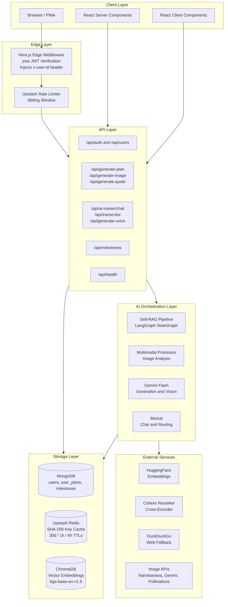
```mermaid
graph TB
    subgraph Client["Client Layer"]
        Browser["Browser / PWA"]
        RSC["React Server Components"]
        RCC["React Client Components"]
    end

    subgraph Edge["Edge Layer"]
        Middleware["Next.js Edge Middleware\njose JWT Verification\nInjects x-user-id header"]
        RateLimit["Upstash Rate Limiter\nSliding Window"]
    end

    subgraph API["API Layer"]
        AuthAPI["/api/auth and /api/users"]
        PlanAPI["/api/generate-plan\n/api/generate-image\n/api/generate-quote"]
        TrainerAPI["/api/ai-trainer/chat\n/api/transcribe\n/api/generate-voice"]
        MilestoneAPI["/api/milestones"]
        HealthAPI["/api/health"]
    end

    subgraph AI["AI Orchestration Layer"]
        SelfRAG["Self-RAG Pipeline\nLangGraph StateGraph"]
        Multimodal["Multimodal Processor\nImage Analysis"]
        Gemini["Gemini Flash\nGeneration and Vision"]
        Mistral["Mistral\nChat and Routing"]
    end

    subgraph Storage["Storage Layer"]
        MongoDB[("MongoDB\nusers, user_plans, milestones")]
        Redis[("Upstash Redis\nSHA-256 Key Cache\n30d / 1h / 6h TTLs")]
        ChromaDB[("ChromaDB\nVector Embeddings\nbge-base-en-v1.5")]
    end

    subgraph External["External Services"]
        HuggingFace["HuggingFace\nEmbeddings"]
        Cohere["Cohere Reranker\nCross-Encoder"]
        DuckDuckGo["DuckDuckGo\nWeb Fallback"]
        ImageAPIs["Image APIs\nNanobanana, Gemini, Pollinations"]
    end

    Browser --> Middleware
    Middleware --> RateLimit
    RateLimit --> API
    API --> AI
    API --> Storage
    AI --> Storage
    AI --> External
    RSC --> API
    RCC --> API
```

---

## Service Architecture

The production stack runs three Docker services behind an Nginx reverse proxy that handles TLS termination and API-level rate limiting.

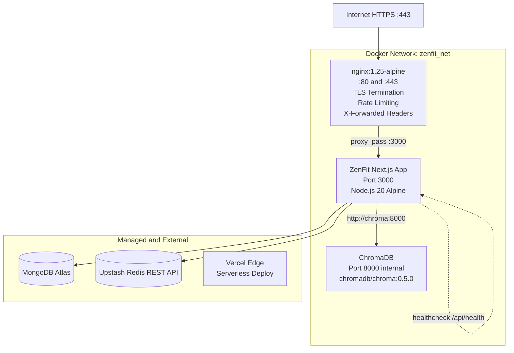
```mermaid
graph TB
    Internet["Internet HTTPS :443"] --> Nginx

    subgraph Docker["Docker Network: zenfit_net"]
        Nginx["nginx:1.25-alpine\n:80 and :443\nTLS Termination\nRate Limiting\nX-Forwarded Headers"]
        App["ZenFit Next.js App\nPort 3000\nNode.js 20 Alpine"]
        Chroma["ChromaDB\nPort 8000 internal\nchromadb/chroma:0.5.0"]
    end

    subgraph Managed["Managed and External"]
        MongoDB2[("MongoDB Atlas")]
        UpstashRedis[("Upstash Redis REST API")]
        Vercel["Vercel Edge\nServerless Deploy"]
    end

    Nginx -->|"proxy_pass :3000"| App
    App -->|"http://chroma:8000"| Chroma
    App --> MongoDB2
    App --> UpstashRedis
    App -.->|"healthcheck /api/health"| App
```

---

## Self-RAG AI Pipeline (LLD)

The AI Trainer is powered by a **graph-based Self-RAG** architecture implemented with LangGraph's `StateGraph`. The graph is compiled **once at module load** and reused across all requests, eliminating cold-start overhead.

### State Shape

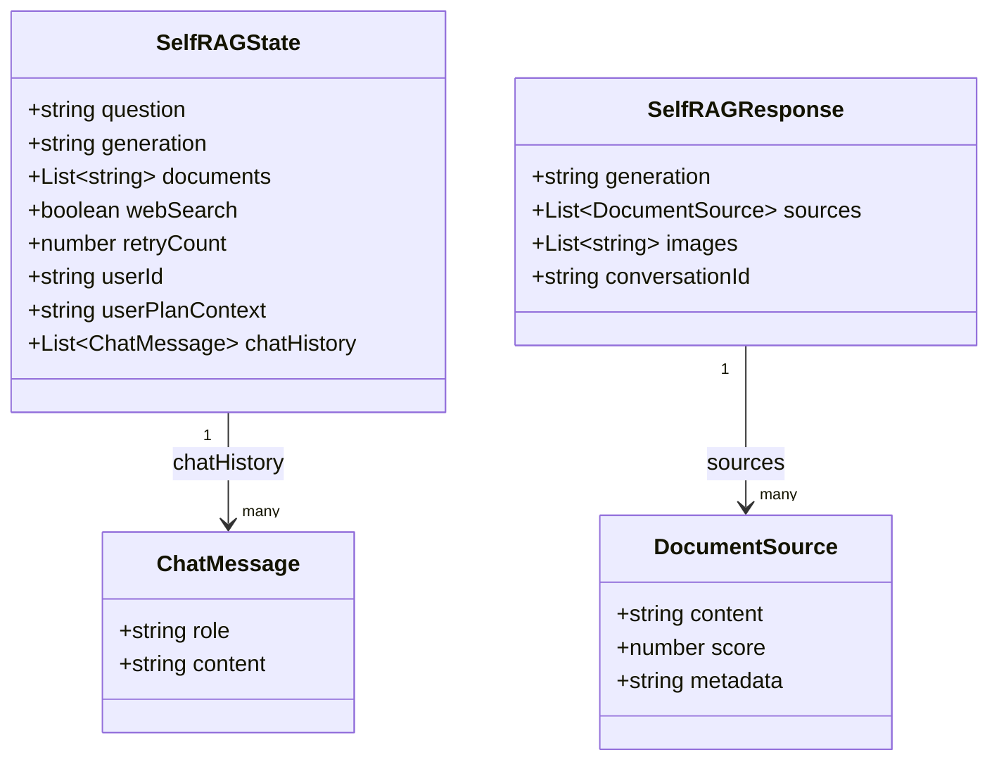
```mermaid
classDiagram
    class SelfRAGState {
        +string question
        +string generation
        +List~string~ documents
        +boolean webSearch
        +number retryCount
        +string userId
        +string userPlanContext
        +List~ChatMessage~ chatHistory
    }

    class ChatMessage {
        +string role
        +string content
    }

    class SelfRAGResponse {
        +string generation
        +List~DocumentSource~ sources
        +List~string~ images
        +string conversationId
    }

    class DocumentSource {
        +string content
        +number score
        +string metadata
    }

    SelfRAGState "1" --> "many" ChatMessage : chatHistory
    SelfRAGResponse "1" --> "many" DocumentSource : sources
```

### Graph Execution Flow

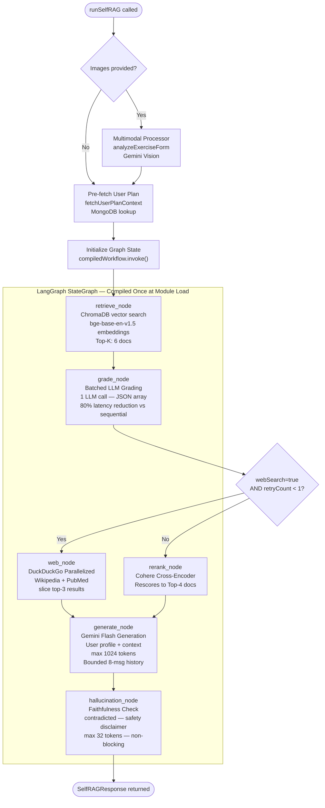
```mermaid
flowchart TD
    Start(["runSelfRAG called"]) --> ImgCheck{"Images provided?"}
    ImgCheck -->|Yes| ImgAnalyze["Multimodal Processor\nanalyzeExerciseForm\nGemini Vision"]
    ImgCheck -->|No| PlanFetch
    ImgAnalyze --> PlanFetch["Pre-fetch User Plan\nfetchUserPlanContext\nMongoDB lookup"]

    PlanFetch --> GraphInit["Initialize Graph State\ncompiledWorkflow.invoke()"]

    GraphInit --> RetrieveNode

    subgraph LangGraph["LangGraph StateGraph — Compiled Once at Module Load"]
        RetrieveNode["retrieve_node\nChromaDB vector search\nbge-base-en-v1.5 embeddings\nTop-K: 6 docs"]

        GradeNode["grade_node\nBatched LLM Grading\n1 LLM call — JSON array\n80% latency reduction vs sequential"]

        RerankNode["rerank_node\nCohere Cross-Encoder\nRescores to Top-4 docs"]

        WebNode["web_node\nDuckDuckGo Parallelized\nWikipedia + PubMed\nslice top-3 results"]

        GenerateNode["generate_node\nGemini Flash Generation\nUser profile + context\nmax 1024 tokens\nBounded 8-msg history"]

        HallucinationNode["hallucination_node\nFaithfulness Check\ncontradicted — safety disclaimer\nmax 32 tokens — non-blocking"]
    end

    RetrieveNode --> GradeNode
    GradeNode --> GradeDecision{"webSearch=true\nAND retryCount < 1?"}
    GradeDecision -->|Yes| WebNode
    GradeDecision -->|No| RerankNode
    WebNode --> GenerateNode
    RerankNode --> GenerateNode
    GenerateNode --> HallucinationNode
    HallucinationNode --> End(["SelfRAGResponse returned"])
```

### Query Classification — Zero-Cost Fast Path

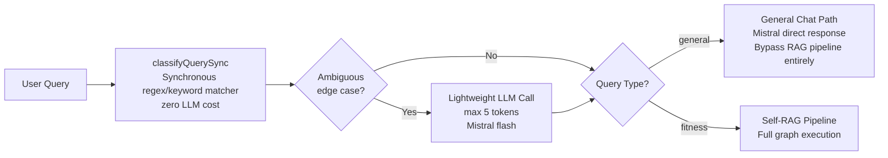
```mermaid
flowchart LR
    Query["User Query"] --> Classifier["classifyQuerySync\nSynchronous regex/keyword matcher\nzero LLM cost"]

    Classifier --> EdgeCase{"Ambiguous\nedge case?"}
    EdgeCase -->|Yes| LightLLM["Lightweight LLM Call\nmax 5 tokens\nMistral flash"]
    EdgeCase -->|No| TypeDecision

    LightLLM --> TypeDecision{"Query Type?"}
    TypeDecision -->|general| GeneralChat["General Chat Path\nMistral direct response\nBypass RAG pipeline entirely"]
    TypeDecision -->|fitness| SelfRAGPipeline["Self-RAG Pipeline\nFull graph execution"]
```

---

## Data Flow Diagrams

### Authentication Flow

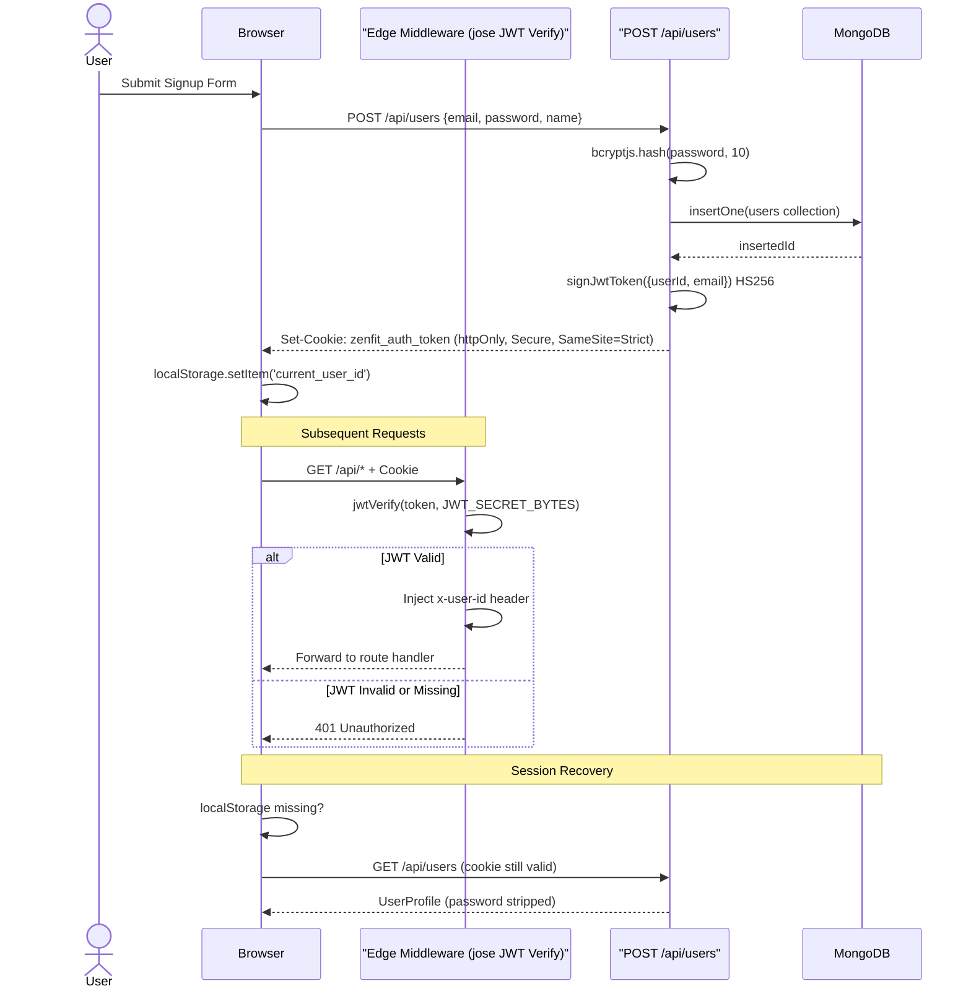
```mermaid
sequenceDiagram
    actor User
    participant Browser
    participant EdgeMiddleware as "Edge Middleware (jose JWT Verify)"
    participant AuthAPI as "POST /api/users"
    participant MongoDB

    User->>Browser: Submit Signup Form
    Browser->>AuthAPI: POST /api/users {email, password, name}
    AuthAPI->>AuthAPI: bcryptjs.hash(password, 10)
    AuthAPI->>MongoDB: insertOne(users collection)
    MongoDB-->>AuthAPI: insertedId
    AuthAPI->>AuthAPI: signJwtToken({userId, email}) HS256
    AuthAPI-->>Browser: Set-Cookie: zenfit_auth_token (httpOnly, Secure, SameSite=Strict)
    Browser->>Browser: localStorage.setItem('current_user_id')

    Note over Browser, EdgeMiddleware: Subsequent Requests

    Browser->>EdgeMiddleware: GET /api/* + Cookie
    EdgeMiddleware->>EdgeMiddleware: jwtVerify(token, JWT_SECRET_BYTES)
    alt JWT Valid
        EdgeMiddleware->>EdgeMiddleware: Inject x-user-id header
        EdgeMiddleware-->>Browser: Forward to route handler
    else JWT Invalid or Missing
        EdgeMiddleware-->>Browser: 401 Unauthorized
    end

    Note over Browser, MongoDB: Session Recovery

    Browser->>Browser: localStorage missing?
    Browser->>AuthAPI: GET /api/users (cookie still valid)
    AuthAPI-->>Browser: UserProfile (password stripped)
```

### Plan Generation Flow

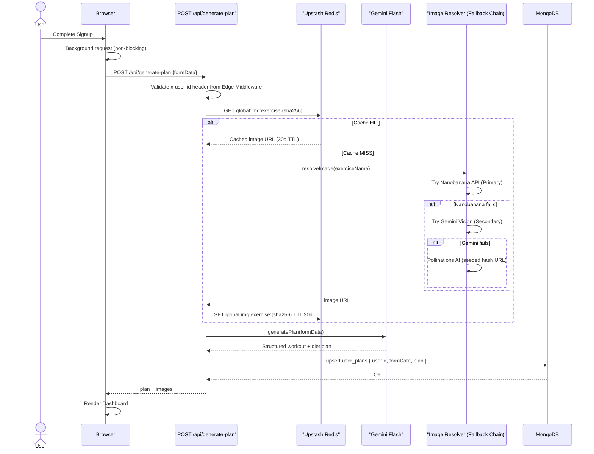
```mermaid
sequenceDiagram
    actor User
    participant Browser
    participant PlanAPI as "POST /api/generate-plan"
    participant Redis as "Upstash Redis"
    participant Gemini as "Gemini Flash"
    participant ImageResolver as "Image Resolver (Fallback Chain)"
    participant MongoDB

    User->>Browser: Complete Signup
    Browser->>Browser: Background request (non-blocking)
    Browser->>PlanAPI: POST /api/generate-plan {formData}
    PlanAPI->>PlanAPI: Validate x-user-id header from Edge Middleware

    PlanAPI->>Redis: GET global:img:exercise:{sha256}
    alt Cache HIT
        Redis-->>PlanAPI: Cached image URL (30d TTL)
    else Cache MISS
        PlanAPI->>ImageResolver: resolveImage(exerciseName)
        ImageResolver->>ImageResolver: Try Nanobanana API (Primary)
        alt Nanobanana fails
            ImageResolver->>ImageResolver: Try Gemini Vision (Secondary)
            alt Gemini fails
                ImageResolver->>ImageResolver: Pollinations AI (seeded hash URL)
            end
        end
        ImageResolver-->>PlanAPI: image URL
        PlanAPI->>Redis: SET global:img:exercise:{sha256} TTL 30d
    end

    PlanAPI->>Gemini: generatePlan(formData)
    Gemini-->>PlanAPI: Structured workout + diet plan
    PlanAPI->>MongoDB: upsert user_plans { userId, formData, plan }
    MongoDB-->>PlanAPI: OK
    PlanAPI-->>Browser: plan + images
    Browser->>Browser: Render Dashboard
```

### AI Trainer Chat Flow

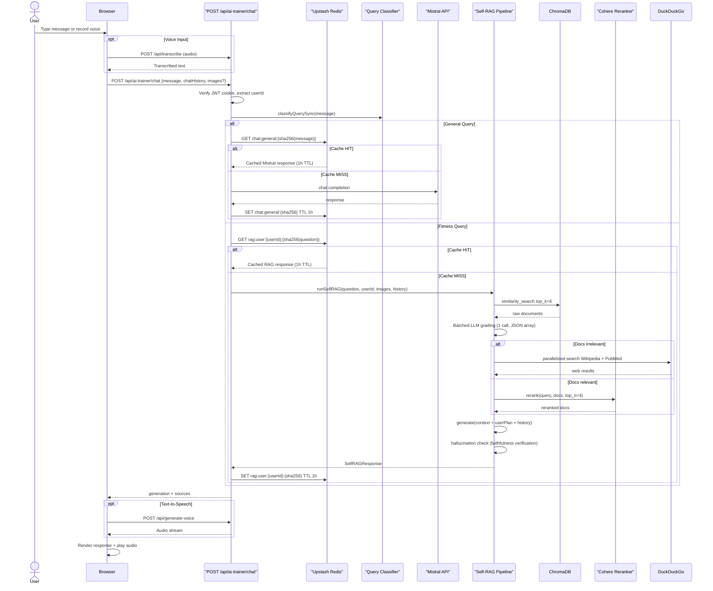
```mermaid
sequenceDiagram
    actor User
    participant Browser
    participant TrainerAPI as "POST /api/ai-trainer/chat"
    participant Redis as "Upstash Redis"
    participant Classifier as "Query Classifier"
    participant MistralAPI as "Mistral API"
    participant SelfRAG as "Self-RAG Pipeline"
    participant ChromaDB
    participant Cohere as "Cohere Reranker"
    participant DuckDuckGo

    User->>Browser: Type message or record voice
    opt Voice Input
        Browser->>TrainerAPI: POST /api/transcribe (audio)
        TrainerAPI-->>Browser: Transcribed text
    end

    Browser->>TrainerAPI: POST /api/ai-trainer/chat {message, chatHistory, images?}
    TrainerAPI->>TrainerAPI: Verify JWT cookie, extract userId
    TrainerAPI->>Classifier: classifyQuerySync(message)

    alt General Query
        TrainerAPI->>Redis: GET chat:general:{sha256(message)}
        alt Cache HIT
            Redis-->>TrainerAPI: Cached Mistral response (1h TTL)
        else Cache MISS
            TrainerAPI->>MistralAPI: chat completion
            MistralAPI-->>TrainerAPI: response
            TrainerAPI->>Redis: SET chat:general:{sha256} TTL 1h
        end
    else Fitness Query
        TrainerAPI->>Redis: GET rag:user:{userId}:{sha256(question)}
        alt Cache HIT
            Redis-->>TrainerAPI: Cached RAG response (1h TTL)
        else Cache MISS
            TrainerAPI->>SelfRAG: runSelfRAG(question, userId, images, history)
            SelfRAG->>ChromaDB: similarity_search top_k=6
            ChromaDB-->>SelfRAG: raw documents
            SelfRAG->>SelfRAG: Batched LLM grading (1 call, JSON array)
            alt Docs irrelevant
                SelfRAG->>DuckDuckGo: parallelized search Wikipedia + PubMed
                DuckDuckGo-->>SelfRAG: web results
            else Docs relevant
                SelfRAG->>Cohere: rerank(query, docs, top_n=4)
                Cohere-->>SelfRAG: reranked docs
            end
            SelfRAG->>SelfRAG: generate(context + userPlan + history)
            SelfRAG->>SelfRAG: hallucination check (faithfulness verification)
            SelfRAG-->>TrainerAPI: SelfRAGResponse
            TrainerAPI->>Redis: SET rag:user:{userId}:{sha256} TTL 1h
        end
    end

    TrainerAPI-->>Browser: generation + sources
    opt Text-to-Speech
        Browser->>TrainerAPI: POST /api/generate-voice
        TrainerAPI-->>Browser: Audio stream
    end
    Browser->>Browser: Render response + play audio
```

---

## Database Schema

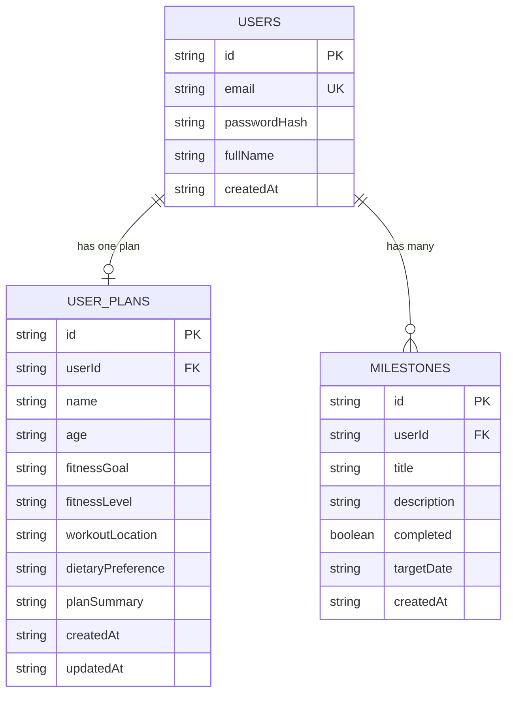
```mermaid
erDiagram
    USERS {
        string id PK
        string email UK
        string passwordHash
        string fullName
        string createdAt
    }

    USER_PLANS {
        string id PK
        string userId FK
        string name
        string age
        string fitnessGoal
        string fitnessLevel
        string workoutLocation
        string dietaryPreference
        string planSummary
        string createdAt
        string updatedAt
    }

    MILESTONES {
        string id PK
        string userId FK
        string title
        string description
        boolean completed
        string targetDate
        string createdAt
    }

    USERS ||--o| USER_PLANS : "has one plan"
    USERS ||--o{ MILESTONES : "has many"
```

---

## Caching Layer Design

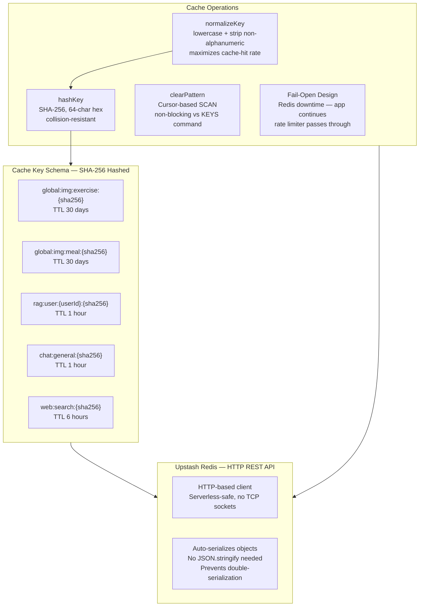
```mermaid
graph TD
    subgraph KeySchema["Cache Key Schema — SHA-256 Hashed"]
        ImgExercise["global:img:exercise:{sha256}\nTTL 30 days"]
        ImgMeal["global:img:meal:{sha256}\nTTL 30 days"]
        RAGResponse["rag:user:{userId}:{sha256}\nTTL 1 hour"]
        GeneralChat["chat:general:{sha256}\nTTL 1 hour"]
        WebSearch["web:search:{sha256}\nTTL 6 hours"]
    end

    subgraph Operations["Cache Operations"]
        Normalize["normalizeKey\nlowercase + strip non-alphanumeric\nmaximizes cache-hit rate"]
        Hash["hashKey\nSHA-256, 64-char hex\ncollision-resistant"]
        SCAN["clearPattern\nCursor-based SCAN\nnon-blocking vs KEYS command"]
        FailOpen["Fail-Open Design\nRedis downtime — app continues\nrate limiter passes through"]
    end

    subgraph UpstashRedis["Upstash Redis — HTTP REST API"]
        HTTPBased["HTTP-based client\nServerless-safe, no TCP sockets"]
        AutoSerialize["Auto-serializes objects\nNo JSON.stringify needed\nPrevents double-serialization"]
    end

    Normalize --> Hash
    Hash --> KeySchema
    KeySchema --> UpstashRedis
    Operations --> UpstashRedis
```

---

## Image Resolution Pipeline

ZenFit implements a 3-tier, fault-tolerant fallback chain guaranteeing 100% image availability.

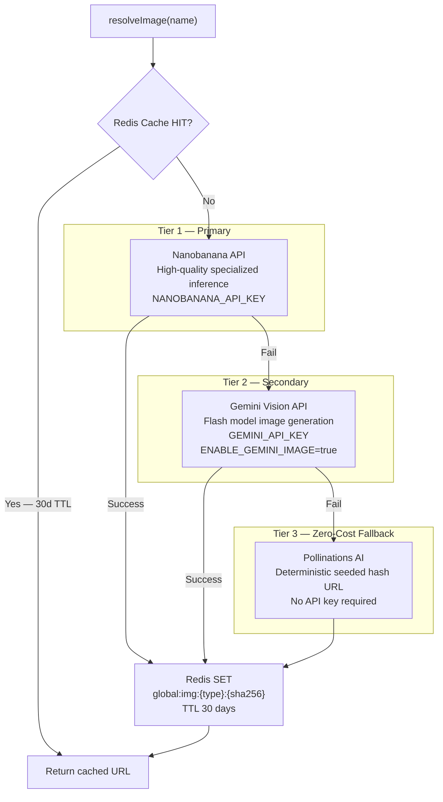
```mermaid
flowchart TD
    Request["resolveImage(name)"] --> CacheCheck{"Redis Cache HIT?"}

    CacheCheck -->|"Yes — 30d TTL"| Return["Return cached URL"]
    CacheCheck -->|No| Primary

    subgraph Tier1["Tier 1 — Primary"]
        Primary["Nanobanana API\nHigh-quality specialized inference\nNANOBANANA_API_KEY"]
    end

    subgraph Tier2["Tier 2 — Secondary"]
        Secondary["Gemini Vision API\nFlash model image generation\nGEMINI_API_KEY\nENABLE_GEMINI_IMAGE=true"]
    end

    subgraph Tier3["Tier 3 — Zero-Cost Fallback"]
        Tertiary["Pollinations AI\nDeterministic seeded hash URL\nNo API key required"]
    end

    Primary -->|Success| CacheSet
    Primary -->|Fail| Secondary
    Secondary -->|Success| CacheSet
    Secondary -->|Fail| Tertiary
    Tertiary --> CacheSet

    CacheSet["Redis SET\nglobal:img:{type}:{sha256}\nTTL 30 days"] --> Return
```

---

## API Routes

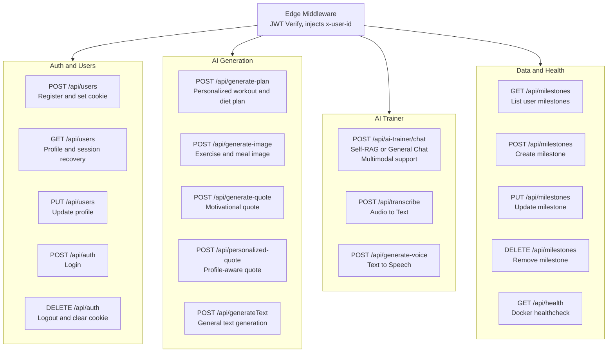
```mermaid
graph TB
    EdgeMiddleware["Edge Middleware\nJWT Verify, injects x-user-id"]

    subgraph Auth["Auth and Users"]
        POST_users["POST /api/users\nRegister and set cookie"]
        GET_users["GET /api/users\nProfile and session recovery"]
        PUT_users["PUT /api/users\nUpdate profile"]
        POST_auth["POST /api/auth\nLogin"]
        DELETE_auth["DELETE /api/auth\nLogout and clear cookie"]
    end

    subgraph Generation["AI Generation"]
        POST_plan["POST /api/generate-plan\nPersonalized workout and diet plan"]
        POST_image["POST /api/generate-image\nExercise and meal image"]
        POST_quote["POST /api/generate-quote\nMotivational quote"]
        POST_pquote["POST /api/personalized-quote\nProfile-aware quote"]
        POST_text["POST /api/generateText\nGeneral text generation"]
    end

    subgraph Trainer["AI Trainer"]
        POST_chat["POST /api/ai-trainer/chat\nSelf-RAG or General Chat\nMultimodal support"]
        POST_transcribe["POST /api/transcribe\nAudio to Text"]
        POST_voice["POST /api/generate-voice\nText to Speech"]
    end

    subgraph Data["Data and Health"]
        GET_milestones["GET /api/milestones\nList user milestones"]
        POST_milestones["POST /api/milestones\nCreate milestone"]
        PUT_milestones["PUT /api/milestones\nUpdate milestone"]
        DELETE_milestones["DELETE /api/milestones\nRemove milestone"]
        GET_health["GET /api/health\nDocker healthcheck"]
    end

    EdgeMiddleware --> Auth
    EdgeMiddleware --> Generation
    EdgeMiddleware --> Trainer
    EdgeMiddleware --> Data
```

---

## Component Architecture

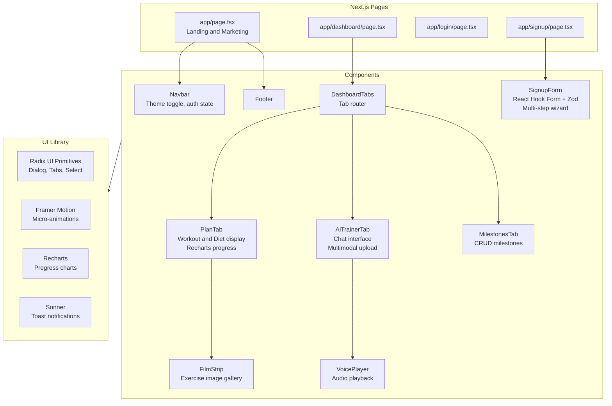
```mermaid
graph TD
    subgraph Pages["Next.js Pages"]
        Landing["app/page.tsx\nLanding and Marketing"]
        Dashboard["app/dashboard/page.tsx"]
        Login["app/login/page.tsx"]
        Signup["app/signup/page.tsx"]
    end

    subgraph Components["Components"]
        Navbar["Navbar\nTheme toggle, auth state"]
        DashboardTabs["DashboardTabs\nTab router"]
        PlanTab["PlanTab\nWorkout and Diet display\nRecharts progress"]
        AiTrainerTab["AiTrainerTab\nChat interface\nMultimodal upload"]
        MilestonesTab["MilestonesTab\nCRUD milestones"]
        SignupForm["SignupForm\nReact Hook Form + Zod\nMulti-step wizard"]
        FilmStrip["FilmStrip\nExercise image gallery"]
        VoicePlayer["VoicePlayer\nAudio playback"]
        Footer["Footer"]
    end

    subgraph UILib["UI Library"]
        Radix["Radix UI Primitives\nDialog, Tabs, Select"]
        Framer["Framer Motion\nMicro-animations"]
        Recharts["Recharts\nProgress charts"]
        Sonner["Sonner\nToast notifications"]
    end

    Landing --> Navbar
    Landing --> Footer
    Dashboard --> DashboardTabs
    DashboardTabs --> PlanTab
    DashboardTabs --> AiTrainerTab
    DashboardTabs --> MilestonesTab
    Signup --> SignupForm
    AiTrainerTab --> VoicePlayer
    PlanTab --> FilmStrip
    Components --> UILib
```

---

## CI/CD Pipeline

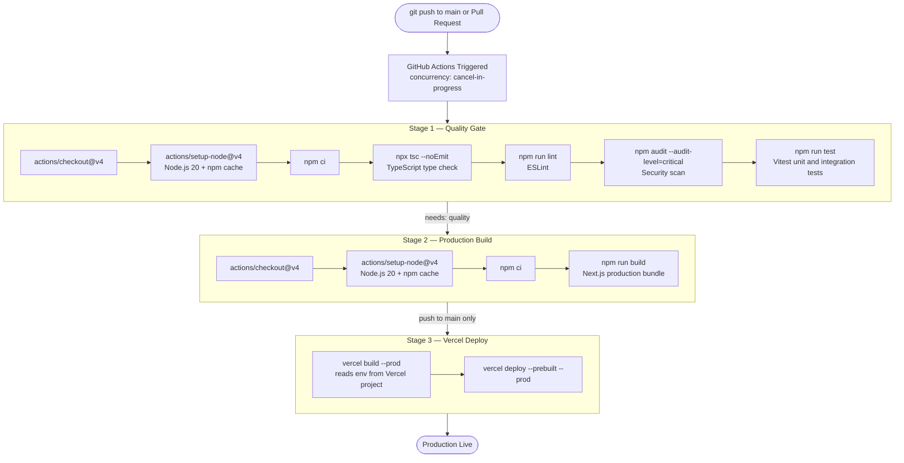
```mermaid
flowchart TD
    Push(["git push to main or Pull Request"]) --> Trigger["GitHub Actions Triggered\nconcurrency: cancel-in-progress"]

    Trigger --> Stage1

    subgraph Stage1["Stage 1 — Quality Gate"]
        Checkout1["actions/checkout@v4"]
        Node1["actions/setup-node@v4\nNode.js 20 + npm cache"]
        Install1["npm ci"]
        TypeCheck["npx tsc --noEmit\nTypeScript type check"]
        Lint["npm run lint\nESLint"]
        Audit["npm audit --audit-level=critical\nSecurity scan"]
        Tests["npm run test\nVitest unit and integration tests"]

        Checkout1 --> Node1 --> Install1 --> TypeCheck --> Lint --> Audit --> Tests
    end

    Stage1 -->|"needs: quality"| Stage2

    subgraph Stage2["Stage 2 — Production Build"]
        Checkout2["actions/checkout@v4"]
        Node2["actions/setup-node@v4\nNode.js 20 + npm cache"]
        Install2["npm ci"]
        Build["npm run build\nNext.js production bundle"]

        Checkout2 --> Node2 --> Install2 --> Build
    end

    Stage2 -->|"push to main only"| Deploy

    subgraph Deploy["Stage 3 — Vercel Deploy"]
        VercelBuild["vercel build --prod\nreads env from Vercel project"]
        VercelDeploy["vercel deploy --prebuilt --prod"]
        VercelBuild --> VercelDeploy
    end

    Deploy --> Live(["Production Live"])
```

---

## Tech Stack

| Category | Technology | Purpose |
|---|---|---|
| **Framework** | Next.js 16, React 19, TypeScript 5 | Full-stack App Router architecture |
| **Styling** | Tailwind CSS v4, Framer Motion | Utility CSS + micro-animations |
| **UI Components** | Radix UI, shadcn/ui, Lucide Icons | Accessible headless components |
| **AI (Chat)** | Mistral AI, Gemini Flash | Chat completions, query routing |
| **AI (Embeddings)** | HuggingFace `bge-base-en-v1.5` | Vector embeddings for RAG |
| **AI (Reranking)** | Cohere Cross-Encoder | Document relevance reranking |
| **AI (Vision)** | Gemini Vision, Nanobanana, Pollinations | Multimodal image analysis + generation |
| **AI Orchestration** | LangGraph `StateGraph`, LangChain | Graph-based Self-RAG pipeline |
| **Vector DB** | ChromaDB `0.5.0` | Document embeddings store |
| **Database** | MongoDB (Native Driver) `6.20.0` | Primary data store |
| **Cache** | Upstash Redis (HTTP REST) | Serverless-safe distributed cache |
| **Auth** | `jose` (Edge JWTs), `bcryptjs` | Stateless HS256 JWTs |
| **Validation** | Zod `3.25.76` | Runtime schema validation |
| **Forms** | React Hook Form + Zod resolvers | Type-safe form handling |
| **Charts** | Recharts | Progress visualization |
| **Testing** | Vitest, Playwright | Unit/integration + E2E |
| **Linting** | ESLint + TypeScript | Code quality gates |
| **Containerization** | Docker, docker-compose | Multi-service orchestration |
| **Proxy** | Nginx 1.25 Alpine | TLS, rate limiting, proxying |
| **Deployment** | Vercel (Serverless) | Edge deployment platform |
| **CI/CD** | GitHub Actions | Automated quality gates + deploy |
| **Web Search** | DuckDuckGo Scrape | RAG fallback (Wikipedia + PubMed) |

---

## Running Locally

### Prerequisites

- Node.js >= 20
- Docker & Docker Compose (for ChromaDB)
- MongoDB Atlas URI or local MongoDB
- Upstash Redis account

### Steps

**1. Clone and install:**
```bash
git clone <repo-url>
cd y
npm install
```

**2. Configure environment variables:**
```bash
cp .env.example .env
# Fill in all required keys
```

**3. Start ChromaDB:**
```bash
docker compose up chroma -d
```

**4. Seed the knowledge base (optional but recommended):**
```bash
npm run seed
```

**5. Start dev server:**
```bash
npm run dev
```

The app will be available at `http://localhost:3000`.

### Full production stack locally

```bash
docker compose up --build
```

This starts `app` (Next.js), `chroma` (vector store), and `nginx` (reverse proxy) together.

---

## Environment Variables

### Required

```bash
# Database
MONGODB_URI=mongodb+srv://<user>:<pass>@cluster.mongodb.net/<db>

# Authentication (min 32 characters)
JWT_SECRET=your_jwt_secret_at_least_32_characters_long

# AI Providers
MISTRAL_API_KEY=your_mistral_api_key
HF_API_KEY=your_huggingface_api_key
GEMINI_API_KEY=your_gemini_api_key

# Cache
UPSTASH_REDIS_REST_URL=https://your-instance.upstash.io
UPSTASH_REDIS_REST_TOKEN=your_upstash_token

# App URL
NEXT_PUBLIC_APP_URL=https://your-domain.example
```

### ChromaDB (choose one)

```bash
# Option A: Local Docker
CHROMA_SERVER_URL=http://chroma:8000

# Option B: Chroma Cloud (all three must be present to activate)
CHROMA_API_KEY=your_chroma_cloud_key
CHROMA_TENANT_ID=your_tenant_id
CHROMA_DATABASE=your_database_name
```

### Optional AI/Media

```bash
NANOBANANA_API_KEY=        # Primary image generation (Tier 1)
ENABLE_GEMINI_IMAGE=false  # Set true to enable Gemini image gen (Tier 2)
```

### CI/CD Secrets (GitHub)

```bash
VERCEL_TOKEN=
VERCEL_ORG_ID=
VERCEL_PROJECT_ID=
```

> **Note:** Runtime secrets (`MONGODB_URI`, `JWT_SECRET`, AI keys, Upstash keys, Chroma keys) must also be configured in the **Vercel project environment** because `vercel build --prod` reads production variables from Vercel, not from GitHub secrets.

---

## Docker & Nginx

### Services

| Service | Image | Port | Role |
|---|---|---|---|
| `app` | Multi-stage Dockerfile | `3000` | Next.js application |
| `chroma` | `chromadb/chroma:0.5.0` | `127.0.0.1:8000` | Vector store (internal only) |
| `nginx` | `nginx:1.25-alpine` | `80`, `443` | Reverse proxy + TLS |

All services share the `zenfit_net` bridge network. ChromaDB is bound to `127.0.0.1` only — not exposed publicly.

### Health Checks

- **app**: `wget -qO- http://localhost:3000/api/health` — every 30s
- **chroma**: `curl -f http://localhost:8000/api/v2/heartbeat` — every 20s
- **nginx**: waits for `app` to be healthy before starting

### Production Nginx Setup

```bash
# Update server_name in nginx/nginx.conf
# Mount valid TLS certificates:
nginx/ssl/fullchain.pem
nginx/ssl/privkey.pem
```

Nginx handles TLS termination, `proxy_pass` to `app:3000`, API/auth rate limiting, `X-Forwarded-*` header forwarding, and the ACME challenge webroot at `/var/www/certbot` for Let's Encrypt renewal.

---

## Key Design Decisions

### 1. Stateless JWT Edge Verification vs DB Sessions

| Aspect | Decision |
|---|---|
| **Choice** | HS256 JWTs verified at the Edge using `jose` |
| **Why** | Eliminates DB roundtrip per request; reduces TTFB |
| **Trade-off** | No immediate server-side token revocation |
| **Mitigation** | Short-lived JWT expiry windows + `httpOnly` cookies |

### 2. Batched Document Grading (1 LLM call vs N calls)

| Aspect | Decision |
|---|---|
| **Choice** | Single LLM call returning a JSON array grading all documents |
| **Why** | 80% latency reduction vs sequential grading (6 docs → previously 6 calls) |
| **Trade-off** | Slightly less granular per-document grading prompt |
| **Mitigation** | Cohere cross-encoder reranking post-filter compensates |

### 3. Fail-Open Rate Limiting

| Aspect | Decision |
|---|---|
| **Choice** | Rate limiter fails open on Redis downtime |
| **Why** | Uptime priority over strict rate enforcement during outages |
| **Trade-off** | Brief window of unthrottled traffic if Redis is down |
| **Mitigation** | Nginx-level rate limiting provides a secondary enforcement layer |

### 4. Zod Warn-on-Failure for AI Responses

| Aspect | Decision |
|---|---|
| **Choice** | Inbound: strict 400 block · Outbound AI responses: warn + log |
| **Why** | LLMs can occasionally drift on optional JSON fields |
| **Trade-off** | Possible schema drift reaches the UI |
| **Mitigation** | Logged for monitoring; missing optional fields do not crash the UI |

### 5. SHA-256 Cache Key Hashing

| Aspect | Decision |
|---|---|
| **Choice** | SHA-256 hash of normalized input for all Redis cache keys |
| **Why** | Fixed 64-char keys prevent Redis key-length issues; collision-resistant |
| **Trade-off** | Keys are not human-readable in Redis dashboards |
| **Mitigation** | Namespace prefixes (`rag:user:`, `global:img:`, etc.) preserve debuggability |

### 6. LangGraph Compiled Once at Module Load

| Aspect | Decision |
|---|---|
| **Choice** | `compiledWorkflow` is a module-level constant |
| **Why** | Avoids repeated `.compile()` overhead on every request |
| **Trade-off** | Graph topology is fixed at boot time |
| **Mitigation** | Acceptable since the RAG graph shape does not change at runtime |

---

<div align="center">

Built with Next.js, LangGraph, MongoDB, Upstash Redis, and ChromaDB.

</div>
